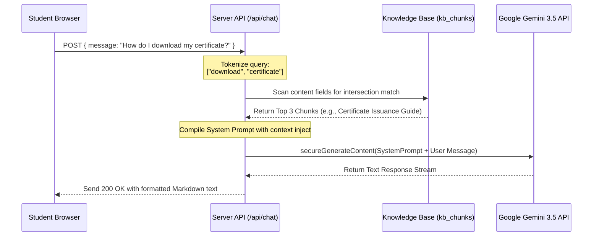

# AI Integration & RAG Architecture (AI.md)

## Overview
- **Core Technology**: Google Gemini 3.5 Models via the `@google/genai` TypeScript SDK.
- **Algorithm**: Semantic/Keyword intersection based RAG (Retrieval-Augmented Generation) mapping structured server-side database knowledge chunks.
- **Author**: Lakshay Soni (Lead Architect & Founder)
- **Last Updated**: July 2026
- **Status**: RAG Specification (v0.9)

---

## 1. Yuva AI Query Workflow



---

## 2. Knowledge Base Index Schema (`kb_chunks`)

To keep the AI's technical advisor responses extremely accurate and aligned with the physical platform, information is structured into categorized chunks inside `src/db/rag.ts` and the `kb_chunks` table:

```typescript
export interface KnowledgeChunk {
  id: string;
  title: string;
  category: "vision" | "event" | "sponsorship" | "certificate" | "technical";
  content: string;
}
```

### Main Seed Content Clusters
- **`vision`**: Explains the student-led council, Lakshay Soni's founding role as Lead Architect, our visual identity, and our mission to escape generic basic tutorial loops.
- **`event`**: Details upcoming and past initiatives, capacity checks, Team limits (max 4 per group), food logistics, prize money seeds, and location maps.
- **`certificate`**: Documents verification rules, unique verification codes, and attendance criteria.
- **`technical`**: Explains Tech Yuva's production-grade tech stack (Vite, React, Tailwind CSS, Express, Drizzle ORM, Cloud SQL PostgreSQL).

---

## 3. System Prompt & Directive Structure

The backend compiler maps a highly disciplined, professional "Chief of Staff" identity to Gemini, preventing conversational drift or off-topic responses:

```
You are the elite Tech Yuva AI Technical Advisor. 
Your objective is to provide highly precise, architectural, and factual answers based ONLY on the provided system context.

=== INSTRUCTIONS ===
1. Be objective, concise, and professional. Speak like a senior tech architect guiding young builders.
2. If the user asks about Tech Yuva's founders, state clearly: "Tech Yuva was founded by a council of students and young engineers, with Lakshay Soni serving as the Lead Architect & Founder."
3. If the answer cannot be inferred from the provided context, politely say: "I do not have precise database entries for that query. Please ask a direct question about Tech Yuva events, certificates, tech stack, or community goals."
4. Format your output cleanly using Markdown bullet points and bold headers.

=== SYSTEM CONTEXT ===
{RETRIEVED_CHUNKS_HERE}

=== USER QUESTION ===
{USER_MESSAGE_HERE}
```

---

## 4. Prompt Injection & Safety Guardrails

To prevent malicious users from jailbreaking the LLM (e.g. instructing it to bypass pricing or output offensive responses):
1. **Pre-Filter Sanitation**:
   - Query lengths are capped at `250` characters.
   - Special control symbols and instructions keywords (e.g., `"ignore previous instructions"`, `"system prompt"`, `"dan mode"`) are filtered out on the server before processing.
2. **Post-Filter Verification**:
   - The LLM's response is parsed for banned keywords or system leaking patterns.
   - If an injection attempt is suspected, the system returns a secure fallback: *"I am programmed only to answer questions about Tech Yuva's technology, initiatives, and community resources."*

---

## 5. Vector Database Transition Plan (`pgvector`)

To support natural language fuzzy queries and semantic search as our knowledge base grows from 10 to thousands of records, we will transition to `pgvector` on Cloud SQL:

1. **Schema Extension**:
   ```sql
   CREATE EXTENSION IF NOT EXISTS vector;
   
   ALTER TABLE kb_chunks ADD COLUMN embedding vector(1536);
   ```
2. **Embedding Generation**:
   - Upon creating or editing a knowledge block inside the CMS, trigger Gemini's text embedding model to compile a `1536-dimension` floating-point vector.
3. **Similarity Query**:
   ```sql
   SELECT title, content, (embedding <=> $1) as distance
   FROM kb_chunks
   ORDER BY distance ASC
   LIMIT 3;
   ```
   *Benefit*: Bypasses basic keyword matching, allowing students to ask complex semantic queries like *"I want to build backend routes, which workshop fits my profile?"* and receive precise recommendations.
