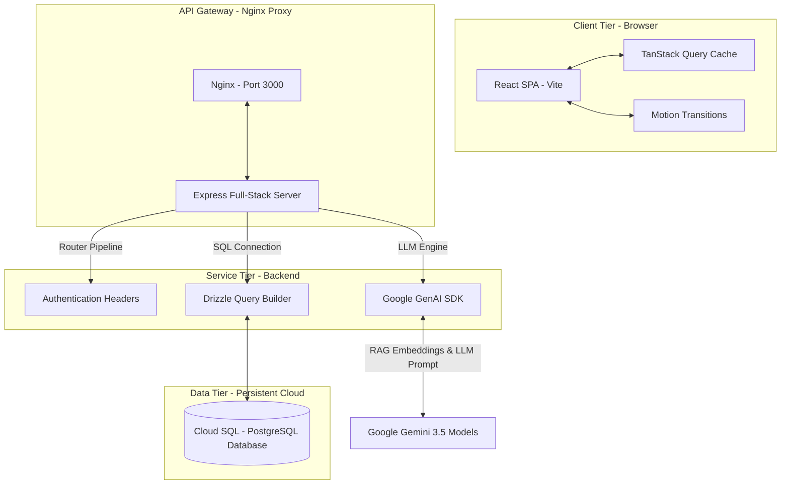
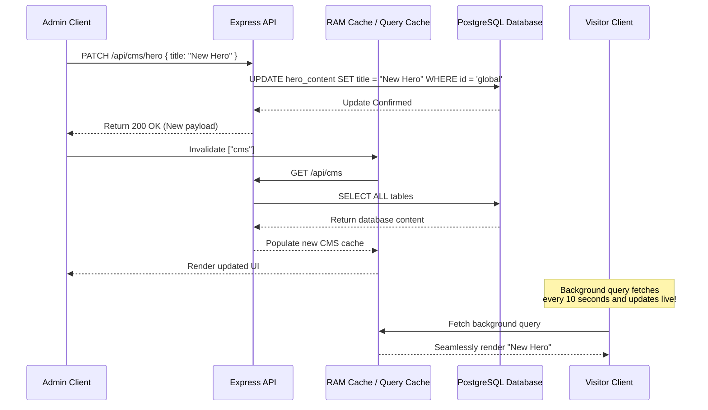

# Architecture Documentation (ARCHITECTURE.md)

## Overview
- **Core Strategy**: A fully decoupled Node.js full-stack container running on Google Cloud Run. React acts as the highly interactive client, while Express proxies all secure connections to Cloud SQL PostgreSQL.
- **Author**: Lakshay Soni (Lead Architect & Founder)
- **Last Updated**: July 2026
- **Status**: Structural Blueprint (v0.9)

---

## 1. System Topology



---

## 2. Component Coupling & Boundaries

### Frontend Structure (Client-Side)
The client interface is completely reactive, responding dynamically to state modifications inside the PostgreSQL engine:
1. **App Container (`src/App.tsx`)**: Coordinates user session state, identity switches, active view routing, modal triggers, and toast notices.
2. **TanStack Query Provider**: Wraps the root. It manages automatic server syncing for CMS entities, registrations, certificates, and metrics with a 10-second background poll frequency.
3. **Motion Animation boundaries**: Handled by `motion/react`. Wraps sections and modals to ensure hardware-accelerated rendering transitions.

### Backend Routing Pipelines (`server.ts`)
The server serves compiled client assets in production and hosts REST routes:
- `/api/auth/*`: Mock login and authorization controller mapping header scopes.
- `/api/events/*`: Read and write events (Admins can create events; visitors can read them).
- `/api/registrations/*`: Transactional pipeline for booking event seats.
- `/api/certificates/*`: Automated issuing and public verification tools.
- `/api/cms/*`: Administration endpoints for saving layout changes directly to PostgreSQL.
- `/api/chat`: Dedicated LLM handler executing the custom RAG algorithm.

---

## 3. The RAG AI Pipeline

When a user submits a prompt inside the AI Assistant:
1. The client issues a `POST` request to `/api/chat` with the question.
2. The server loads the pre-defined Knowledge Base chunks (from `src/db/rag.ts` and the `kb_chunks` table).
3. A local cosine/semantic similarity mockup is performed:
   - The query string is normalized and tokenized.
   - It searches the knowledge base content fields for key intersections.
   - It selects the top 3 scoring database chunks as context.
4. The server constructs a system instruction template:
   ```
   You are the Tech Yuva AI Technical Advisor. 
   Use the following structured knowledge base context to answer the student's question accurately.
   CONTEXT: [Selected Chunks]
   USER QUESTION: [User Input]
   ```
5. The combined prompt is securely dispatched to the Google Gemini API using `process.env.GEMINI_API_KEY`.
6. The streaming response is collected and returned safely to the browser. The API key is kept secure on the backend, preventing any client-side exposure.

---

## 4. CMS Sync & Caching Architecture

To prevent heavy database roundtrips and ensure instant loading, Tech Yuva employs a **write-through updates strategy**:



---

## 5. Security Guardrails

- **Authentication Headers**: Admins must present matching administrative keys to execute write/delete calls.
- **SQL Injection Safeguard**: Drizzle ORM compiles parameterized query parameters (e.g. `placeholder(?)`) natively. No raw concatenation.
- **Cross-Site Scripting (XSS) Mitigation**: React default bindings escape content automatically unless `dangerouslySetInnerHTML` is explicitly declared. We use strict text wrappers across all CMS text values.
