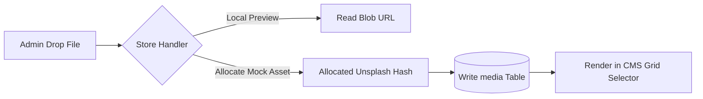

# CMS Module Specification (CMS.md)

## Overview
- **Core Strategy**: A fully custom-built Content Management System (CMS) integrated into the Tech Yuva landing page layout. Allows admins to visually edit database records with instantaneous updates to visitors, bypassing static file rebuilds.
- **Author**: Lakshay Soni (Lead Architect & Founder)
- **Last Updated**: July 2026
- **Status**: System Functional Spec (v0.9)

---

## 1. CMS Architecture & Control Blocks

The CMS contains **9 visual operational controls** mapped directly to tables in the PostgreSQL database:

```
+------------------+---------------------------------------------------------------------------------+
| CONTROL PANEL    | EDITABLE COLUMNS & ASSETS                                                      |
+------------------+---------------------------------------------------------------------------------+
| 1. Hero Content  | Main Display Title, Subheading Copy, Static Metric Cards (JSON Array)           |
| 2. About Cards   | Title, Detailed description, Icon selector class (Mapped to Lucide-React icons) |
| 3. Founder Info  | Display Name (Lakshay Soni), Role, Photo URL, Biography paragraph, Quote string |
| 4. Gallery Snap  | Snapshot URL, Caption Title, Event subtitle, Aspect ratios                      |
| 5. Sponsors Log  | Sponsor Brand Name, Logo image, Tier classification, Site links                 |
| 6. Testimonials  | Author Name, Subtext role, Quote commentary, Approved switch                    |
| 7. System Alerts | Text notification copy, Priority level, Active flag                           |
| 8. SEO Metadata  | Header Title, OgImage OpenGraph target, Description tag, Keyword indexes        |
| 9. Site Config   | Social Handle targets, Hosting server pack text (e.g. "Cloud Run")              |
+------------------+---------------------------------------------------------------------------------+
```

---

## 2. Dynamic Media Library Subsystem



### Drag-and-Drop Uploader
The media subsystem features an interactive file drag area:
- **Client Side Handler**: Hooks onto `onDragOver` and `onDrop`. It reads the local file stream and generates a placeholder URL.
- **Database Reference**: Saves filename, MIME type, and dimensions inside the database for persistent asset management.

---

## 3. SEO Metadata & Dynamic Head Injections

To ensure search engines crawl correct, dynamically-updated landing descriptions:
1. When the landing page loads, React queries the `/api/cms` package.
2. The `seoSettings` are parsed from the PostgreSQL response.
3. React uses an active hook to dynamically inject head variables directly into the document DOM:
   ```typescript
   useEffect(() => {
     if (cmsData?.seoSettings) {
       document.title = cmsData.seoSettings.metaTitle;
       
       // Dynamic description tag mapping
       const metaDesc = document.querySelector('meta[name="description"]');
       if (metaDesc) {
         metaDesc.setAttribute("content", cmsData.seoSettings.metaDescription);
       }
     }
   }, [cmsData]);
   ```

---

## 4. Future Roadmap: Draft vs. Published States

Currently, all modifications saved by administrators update visitors instantly (Live publishing). To support advanced staging and review pipelines:

### Feature Plan
1. **State Flags**: Add an active `status` text flag (`draft`, `published`) across all CMS tables.
2. **Double Table Buffers**:
   - Updates made inside the CMS admin panel write to a `draft` row.
   - Visitors continue reading from the `published` row.
3. **Publish Action**: Clicking "Publish Changes" triggers a transactional swap on PostgreSQL:
   ```sql
   UPDATE site_settings SET content = draft_content, status = 'published' WHERE id = 'global';
   ```
4. **Version History Rollback**: Integrate a `cms_audit_logs` table tracking user ID, timestamp, and a JSON block of preceding configurations, permitting one-click system rollback.
