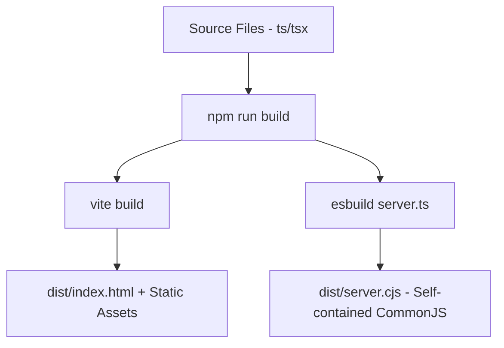

# Deployment & Operations Manual (DEPLOYMENT.md)

## Overview
- **Deployment Platform**: Google Cloud Run (Containerized Server Environment)
- **Database Service**: Google Cloud SQL (Relational PostgreSQL)
- **CI/CD Integration**: GitHub Actions / Google Cloud Build
- **Author**: Lakshay Soni (Lead Architect & Founder)
- **Last Updated**: July 2026
- **Status**: Operations Manual (v0.9)

---

## 1. Environment Variable Reference

The platform requires these environment variables to be injected into the Cloud Run container runtime.

| Variable Name | Required | Default Value | Purpose |
|---|---|---|---|
| `DATABASE_URL` | Yes | N/A | PostgreSQL connection string containing username, host, and database name. |
| `GEMINI_API_KEY` | Yes | N/A | Google Developer API key used for the server-side RAG advisor. |
| `PORT` | No | `3000` | Port of the Express API router. |
| `NODE_ENV` | No | `production` | Set to `production` to activate static asset serving and disable developer logs. |

---

## 2. Compile & Build Pipeline

The deployment build system uses a single unified command (`npm run build`) to compile both the client SPA and the backend Express controller:



### Build Commands Reference
- **Local Dev Compilation**:
  ```bash
  npm run build
  ```
- **Container Production Execution**:
  ```bash
  npm run start
  ```
  Launches `node dist/server.cjs` which loads raw static assets and binds the REST routes.

---

## 3. Database Migrations & Seeding

When deploying Tech Yuva to a fresh PostgreSQL instance, database structures must be generated and seeded:

1. **Install Schema**:
   Run Drizzle migrations to establish tables:
   ```bash
   npx drizzle-kit push:pg
   ```
2. **Seed Initial Content**:
   Expose CMS tables, founder assets, and default initiatives by running the seeder script:
   ```bash
   npx tsx src/db/seedCMS.ts
   ```

---

## 4. Continuous Integration & Deployment (CI/CD)

The project leverages a robust GitHub Actions workflow to auto-deploy changes to Cloud Run upon main branch mergers:

```yaml
name: Deploy to Cloud Run

on:
  push:
    branches: [ main ]

jobs:
  deploy:
    runs-on: ubuntu-latest
    steps:
    - name: Checkout Source
      uses: actions/checkout@v4

    - name: Google Cloud Authentication
      uses: google-github-actions/auth@v2
      with:
        credentials_json: ${{ secrets.GCP_SA_KEY }}

    - name: Set up Cloud SDK
      uses: google-github-actions/setup-gcloud@v2

    - name: Build and Push Docker Image
      run: |
        gcloud builds submit --tag gcr.io/${{ secrets.GCP_PROJECT_ID }}/techyuva:latest

    - name: Deploy Container to Cloud Run
      run: |
        gcloud run deploy techyuva \
          --image gcr.io/${{ secrets.GCP_PROJECT_ID }}/techyuva:latest \
          --platform managed \
          --region asia-southeast1 \
          --allow-unauthenticated \
          --set-env-vars="DATABASE_URL=${{ secrets.PROD_DB_URL }},GEMINI_API_KEY=${{ secrets.PROD_GEMINI_KEY }},NODE_ENV=production"
```

---

## 5. Monitoring, Logging & Backups

### Container Logging
- All API exceptions, server boot messages, and database connection queries are written directly to standard output (`stdout`/`stderr`).
- These logs are automatically ingested by **Google Cloud Logging** (formerly Stackdriver) and are searchable in the Google Cloud Console.

### Cloud SQL PostgreSQL Backups
- **Policy**: Enforced daily automated backups with point-in-time recovery activated.
- **Retention**: Configured to preserve database history snapshots for a minimum of 7 days to protect against administrative deletion errors.
- **Downtime Minimization**: Scale-to-zero capabilities are deactivated on production instances to ensure consistent latencies for student visitors.
