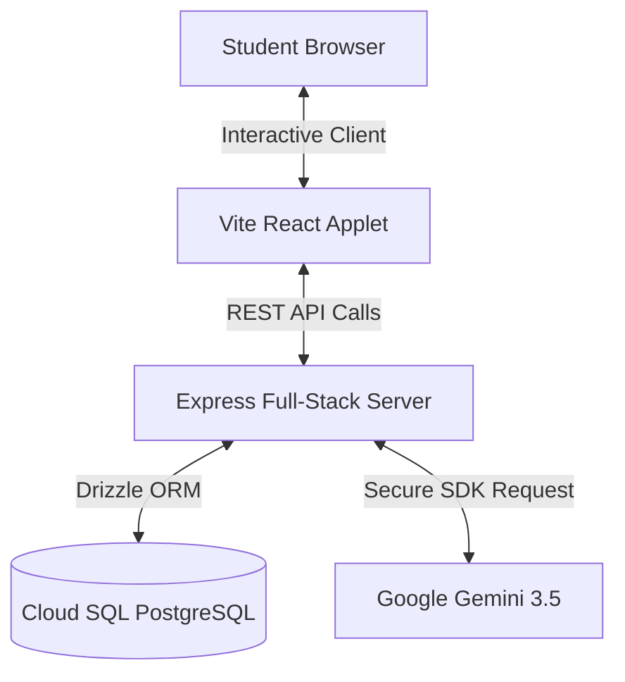

# Tech Yuva Documentation Hub (README.md)

## Welcome to the Core Documentation Hub of Tech Yuva!

This directory acts as the single source of truth for the Tech Yuva Platform. Every file here is written to the standard of an open-source project maintained by a senior engineering team.

---

## 1. Documentation Index & Quick Links

| Module | File Name | Target Content |
|---|---|---|
| **01. Brain & Vision** | [`CONTEXT.md`](./CONTEXT.md) | Project vision, tech stack, directory trees, system philosophy, known limits, coding rules. |
| **02. Product Blueprint** | [`PRODUCT.md`](./PRODUCT.md) | Core problem statements, user personas, complete visitor/member/admin product journeys. |
| **03. System Architecture** | [`ARCHITECTURE.md`](./ARCHITECTURE.md) | Frontend-to-backend-to-database coupling, RAG algorithm pipelines, system diagrams. |
| **04. Database Schema** | [`DATABASE.md`](./DATABASE.md) | Table structures, column data types, constraints, index optimizations, ER diagrams. |
| **05. Endpoint Reference** | [`API.md`](./API.md) | REST JSON routes, request/response models, error codes, authentication requirements. |
| **06. Identity Management** | [`AUTHENTICATION.md`](./AUTHENTICATION.md) | Role access rules, current header-mocking, future Firebase Auth and OAuth migration plans. |
| **07. Layout Content System**| [`CMS.md`](./CMS.md) | Visual CMS operations, dynamically managed components, drag-and-drop media systems. |
| **08. Artificial Intelligence**| [`AI.md`](./AI.md) | Gemini 3.5 instructions, safety, prompt sanitization, vector database roadmap. |
| **09. Brand & Style Spec** | [`UI_DESIGN_SYSTEM.md`](./UI_DESIGN_SYSTEM.md) | Colors, typography, spacing, glassmorphism filters, motion graphics, hover states. |
| **10. Code Component Map** | [`COMPONENTS.md`](./COMPONENTS.md) | Modular React component library definitions, props, children, and performance notes. |
| **11. Safety & Mitigations** | [`SECURITY.md`](./SECURITY.md) | Threat matrix, SQL injection, XSS, rate-limiting, and production hardening lists. |
| **12. Milestones & Goals** | [`ROADMAP.md`](./ROADMAP.md) | 5-phase expansion, development schedules, KPIs, system metrics. |
| **13. Contributor Manual** | [`CONTRIBUTING.md`](./CONTRIBUTING.md) | Setup, commit conventions, git workflows, pull request checklists. |
| **14. Releases & History** | [`CHANGELOG.md`](./CHANGELOG.md) | Release milestones, feature additions, fixes. |
| **15. Operations & DevOps** | [`DEPLOYMENT.md`](./DEPLOYMENT.md) | Environment variables, build systems, docker configurations, monitoring, backups. |
| **16. System Quality Log** | [`QA_REPORT.md`](./QA_REPORT.md) | Categorized bug reports (P0/P1/P2) and completed validation results. |
| **17. Technical Rationale** | [`DESIGN_DECISIONS.md`](./DESIGN_DECISIONS.md) | ADR logs justifying architectural selections (React, Vite, Drizzle, Postgres). |

---

## 2. Architecture Quick Peek



---

## 3. High-Velocity Setup

To get the entire full-stack system compiled and executing locally:

```bash
# 1. Install Dependencies
npm install

# 2. Spin up Database and Seed Tables
npx drizzle-kit push:pg
npx tsx src/db/seedCMS.ts

# 3. Spin up local development server
npm run dev
```

---

## 4. System Standards
- All code modifications must run clean of linting warnings (`npm run lint`).
- Maintain strict type safety across all React components and REST routes.
- Verify security configurations before merging feature commits into the main production branch.
