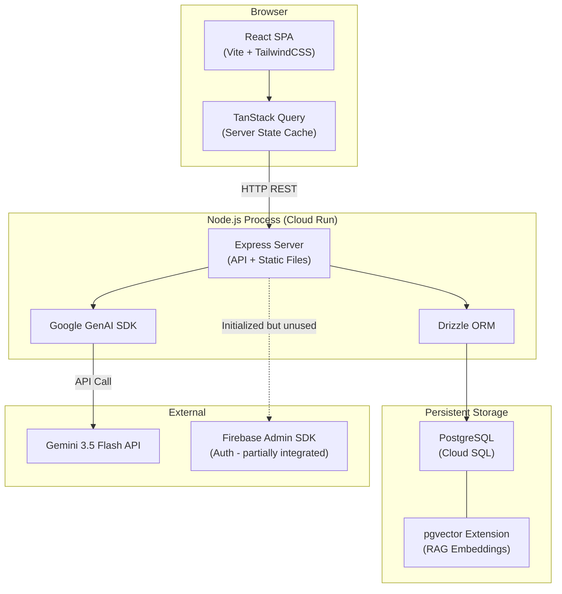

# 00 — PROJECT CONTEXT

> **Tech Yuva Engineering Bible** — Document 1 of 13  
> **Status:** Draft v1.0  
> **Last Updated:** 2026-07-12  
> **Owner:** Engineering Team  
> **Classification:** Internal — Engineering

---

## 1. Product Identity

| Field | Value |
|-------|-------|
| **Product Name** | Tech Yuva |
| **Tagline** | Where Youth Meet To Build Future Tech |
| **Domain** | Community Platform — Student Tech Community Management |
| **Core Function** | Acquire, engage, and retain student developers through events, workshops, hackathons, and AI-powered assistance |
| **Primary URL** | `techyuva.org` (pending) |
| **Current Host** | Google Cloud Run via AI Studio Applet |
| **Version** | 0.9 (pre-production) |

### What Tech Yuva Is

A platform that manages the lifecycle of a student tech community: discovery → registration → event participation → certification → ongoing engagement. It is **not** a content platform, LMS, or social network. It is an **operational backbone** for running physical and virtual tech events at the college/regional level.

### What Tech Yuva Is Not

- Not a learning management system (no courses, no video hosting)
- Not a social network (no feeds, no messaging between users)
- Not a marketplace (no transactions between users)
- Not a job board (no employer-side features)

---

## 2. Stakeholders

| Stakeholder | Role | Primary Concern |
|-------------|------|-----------------|
| **Student Visitors** | Discover the community, register for events | Speed to registration, clarity of value proposition |
| **Registered Members** | Attend events, earn certificates, access dashboards | Event status, certificate retrieval, personal history |
| **Community Admins** | Create events, manage registrations, manage CMS content | Operational efficiency, content control, analytics |
| **Sponsors/Partners** | Provide funding/resources, gain visibility | Clear intake process, brand representation |
| **Founder(s)** | Set vision, approve content, oversee growth | Community metrics, brand consistency |

### Scaling Personas (Future)

| Persona | Description | Estimated Timeline |
|---------|-------------|-------------------|
| **Multi-college Admin** | Admin managing a chapter at a specific college | Phase 2 (multi-tenant) |
| **Regional Coordinator** | Oversees multiple college chapters | Phase 3 |
| **API Consumer** | Third-party app consuming Tech Yuva events/data | Phase 3 |
| **Mobile User** | Native mobile app user | Phase 2 |

---

## 3. Team Structure (Current)

| Role | Person | Responsibilities |
|------|--------|-----------------|
| Founder & Vision | Lakshay Soni | Community direction, event curation, partnerships |
| Technical Architect | Daksh Chaudhary | Platform engineering, infrastructure, design system |

> [!IMPORTANT]
> The current team is 2 people. Every architectural decision in this documentation prioritizes **operational simplicity** over theoretical elegance. We do not build microservices. We do not build Kubernetes clusters. We build a monolith that works, then extract services only when measured bottlenecks demand it.

---

## 4. Current Architecture Summary

### High-Level Topology



### Architecture Style

**Monolithic full-stack application.** Single Node.js process serves both the API and the compiled React frontend. This is the correct architecture for the current scale (< 1,000 users, 1-2 admins, < 50 concurrent connections).

### Key Architecture Decisions

| Decision | Choice | Rationale |
|----------|--------|-----------|
| **Monolith vs. Microservices** | Monolith | Team of 2. < 1K users. Operational simplicity. Extract later when needed. |
| **REST vs. GraphQL** | REST | Simpler to reason about. No complex nested queries needed. Standard tooling. |
| **ORM vs. Raw SQL** | Drizzle ORM | Type-safe queries at compile time. Lightweight. Good migration story. |
| **SPA vs. SSR** | SPA (Vite) | No SEO requirements for authenticated pages. Marketing pages could be SSR later. |
| **State Management** | TanStack Query | Server state only. No complex client state. Auto-refetch, caching, and loading states built in. |
| **CSS Framework** | Tailwind CSS v4 | Utility-first. Fast iteration. Good dark-mode support. |
| **Animation** | Motion (Framer Motion successor) | Production-quality animation library. Hardware-accelerated. |
| **AI Integration** | Google GenAI SDK (Gemini) | Provided by AI Studio deployment context. Supports embeddings and generation. |
| **Vector Search** | pgvector (PostgreSQL extension) | No separate vector database needed. Collocated with relational data. Sufficient for < 100K chunks. |

---

## 5. Tech Stack (Current)

### Frontend

| Package | Version | Purpose |
|---------|---------|---------|
| `react` | 19.0.1 | UI framework |
| `react-dom` | 19.0.1 | DOM rendering |
| `@tanstack/react-query` | 5.101.2 | Server state management |
| `motion` | 12.23.24 | Animation (scroll, mount, hover) |
| `lucide-react` | 0.546.0 | Icon system |
| `tailwindcss` | 4.1.14 | Utility CSS |
| `vite` | 6.2.3 | Build tool and dev server |

### Backend

| Package | Version | Purpose |
|---------|---------|---------|
| `express` | 4.21.2 | HTTP server and API routing |
| `drizzle-orm` | 0.45.2 | Type-safe PostgreSQL ORM |
| `pg` | 8.21.0 | PostgreSQL client driver |
| `@google/genai` | 2.4.0 | Gemini API (chat + embeddings) |
| `firebase-admin` | 14.0.0 | Firebase Auth (initialized, not fully used) |
| `dotenv` | 17.2.3 | Environment variable loading |

### Dev/Build

| Package | Version | Purpose |
|---------|---------|---------|
| `typescript` | 5.8.2 | Type checking |
| `tsx` | 4.21.0 | TypeScript execution (dev server) |
| `esbuild` | 0.25.0 | Server bundle for production |
| `drizzle-kit` | 0.31.10 | Database migrations |

---

## 6. Repository Structure

```
tech-yuva/
├── index.html                    # SPA entry point (meta, OG tags, fonts)
├── server.ts                     # Express server (ALL API routes — 1,257 lines)
├── package.json                  # Dependencies and scripts
├── vite.config.ts                # Vite build configuration
├── tsconfig.json                 # TypeScript compiler config
├── firebase-applet-config.json   # Firebase project linkage
├── .env.example                  # Required environment variables
│
├── public/                       # Static assets served directly
│   ├── tech-yuva-logo.png        # Brand logo (252KB)
│   ├── founder-photo.jpg         # Founder avatar (91KB)
│   └── loading-screen.mp4        # Loading animation video (3MB)
│
├── src/
│   ├── main.tsx                  # React DOM hydration entry
│   ├── App.tsx                   # Root component (1,240 lines — ALL UI sections)
│   ├── index.css                 # Global styles, Tailwind config, animations
│   ├── types.ts                  # Shared TypeScript interfaces
│   ├── data.ts                   # Static fallback data (events, sponsors, etc.)
│   │
│   ├── db/
│   │   ├── index.ts              # PostgreSQL connection pool
│   │   ├── schema.ts             # Drizzle table definitions (17 tables)
│   │   ├── rag.ts                # RAG knowledge base seeder + search
│   │   ├── seedCMS.ts            # CMS default content seeder
│   │   └── drizzle.config.ts     # Migration configuration
│   │
│   └── components/
│       ├── LoadingScreen.tsx      # Cinematic boot animation
│       ├── HeroTerminal.tsx       # Hero section with code simulator
│       ├── FounderVision.tsx      # Founder quote/vision section
│       ├── TechYuvaAI.tsx         # Floating AI chat widget
│       ├── EventRegisterModal.tsx # Event registration form
│       ├── ArchitectureDocs.tsx   # Architecture specs viewer (internal docs)
│       ├── IdentitySwitcher.tsx   # Role simulation tool (dev/demo only)
│       ├── MemberDashboard.tsx    # Member portal (login, registrations, certs)
│       ├── AdminTerminal.tsx      # Admin CLI interface
│       ├── AdminCMS.tsx           # Admin visual CMS (109KB — largest file)
│       ├── CertificateViewer.tsx  # Certificate display modal
│       ├── TechYuvaLogo.tsx       # Brand logo component
│       └── BlurredImage.tsx       # Progressive image loading
│
└── docs/                         # Existing documentation (to be superseded)
    └── *.md                      # 18 markdown files (older, lighter docs)
```

> [!WARNING]
> **Critical structural debt:** `App.tsx` is 1,240 lines and `server.ts` is 1,257 lines. These are the two most important files in the codebase, and both exceed reasonable maintainability thresholds. The architecture documentation (02_ARCHITECTURE.md) will specify how to decompose them.

---

## 7. Known Technical Debt

These findings are derived from the product audit conducted on 2026-07-12. They are categorized by severity.

### P0 — Ship Blockers

| # | Issue | Location | Impact |
|---|-------|----------|--------|
| 1 | **Join Community form discards data** — `setTimeout` fakes a submission, no API call | `App.tsx:152-161` | Zero lead capture. Primary conversion funnel is broken. |
| 2 | **Placeholder URLs in CTAs** — Cards link to literal strings `COMMUNITY_PARTNERS_GOOGLE_FORM_URL` | `App.tsx:1121-1139` | Broken navigation for partnership/sponsorship intake. |
| 3 | **Admin email hardcoded in client** — `dakshchaudhary2668@gmail.com` visible in frontend source | `App.tsx:119` | Any user can call `/api/auth/login` with this email to gain admin access. |
| 4 | **IdentitySwitcher ships to production** — Any visitor can impersonate admin/member | `IdentitySwitcher.tsx` (always rendered) | Complete RBAC bypass. |
| 5 | **No mobile navigation** — `hidden md:flex` on nav, no hamburger menu | `App.tsx:204` | ~60% of target audience cannot navigate the site. |

### P1 — Must Fix

| # | Issue | Location | Impact |
|---|-------|----------|--------|
| 6 | Loading screen replays every visit — `sessionStorage` check is commented out | `LoadingScreen.tsx:46` | 10-15 second delay on every page load. |
| 7 | Sponsor data is fabricated — Listed companies with emoji logos | `data.ts:118-154` | Legal/trust risk. |
| 8 | Testimonials use stock photos — Unsplash URLs for avatars, fictional organizations | `data.ts:156-184` | Fabricated social proof. |
| 9 | Gallery uses generic stock images — No actual event photos | `data.ts:75-116` | Misrepresentation. |
| 10 | OG image uses relative path — Social previews broken | `index.html:18` | Poor share experience. |
| 11 | No auth middleware on public routes — `/api/users` exposes all user data | `server.ts:168-176` | Data exposure. |

### Structural Debt

| Issue | Impact |
|-------|--------|
| `server.ts` is 1,257 lines with all routes in one file | Unmaintainable. No separation of concerns. |
| `App.tsx` is 1,240 lines with all UI sections in one component | Unmaintainable. No code splitting. |
| `AdminCMS.tsx` is 109KB (largest component) | Performance and maintainability issue. |
| No database migrations checked in | Schema changes are destructive. No rollback. |
| No tests of any kind | Zero confidence in refactoring. |
| Firebase Admin SDK initialized but unused for actual auth | Dead dependency. |
| `Date.now()` used for primary key generation | Collision risk under concurrent writes. |

---

## 8. Environment & Configuration

### Required Environment Variables

| Variable | Description | Required | Default |
|----------|-------------|----------|---------|
| `GEMINI_API_KEY` | Google Gemini API key for AI chat and embeddings | Yes | `MY_GEMINI_API_KEY` (placeholder) |
| `APP_URL` | Deployed application URL | Yes | `MY_APP_URL` (placeholder) |
| `DATABASE_URL` | PostgreSQL connection string | Yes (implicit) | Injected by Cloud SQL proxy |

### Missing Environment Variables (Required for Production)

| Variable | Purpose |
|----------|---------|
| `SESSION_SECRET` | For signing session tokens/cookies |
| `ADMIN_EMAILS` | Allowlist of admin email addresses |
| `SMTP_*` | Email delivery for registration confirmations |
| `SENTRY_DSN` | Error tracking |
| `ANALYTICS_ID` | Usage analytics |

---

## 9. Scaling Assumptions

This documentation is written with the following growth trajectory in mind:

| Phase | Users | Admins | Colleges | Key Capability |
|-------|-------|--------|----------|---------------|
| **V1 (Current)** | < 1,000 | 1-2 | 1 | Single community, event management, basic CMS |
| **V2** | 1,000 - 10,000 | 5-10 | 5-10 | Multi-admin RBAC, member dashboard, mobile app |
| **V3** | 10,000 - 100,000 | 20-50 | 50+ | Multi-tenant (college chapters), public API, analytics |
| **V4** | 100,000+ | 100+ | 200+ | Federation, marketplace, enterprise partnerships |

### Architecture Scaling Constraints

| Constraint | Current Limit | Scaling Path |
|------------|--------------|--------------|
| **Single server process** | ~500 concurrent connections | Horizontal scaling via Cloud Run instances (stateless) |
| **PostgreSQL single instance** | ~10,000 QPS | Read replicas, connection pooling (PgBouncer) |
| **pgvector in-database** | ~100,000 embedding rows | Dedicated vector DB at 1M+ chunks |
| **Monolithic server.ts** | ~50 API routes | Extract into route modules, then services at V3 |
| **Client-side state** | Single SPA | Route-based code splitting, then micro-frontends at V4 |

---

## 10. Constraints & Non-Negotiables

| Constraint | Rationale |
|------------|-----------|
| **PostgreSQL only** — No additional databases in V1 | Operational simplicity. One backup strategy. One connection pool. |
| **No paid dependencies** — All libraries must be open-source or free-tier | Student community with zero budget. |
| **Mobile-first responsive** — Every feature must work on 360px viewport | Target audience primarily uses phones. |
| **Accessible (WCAG 2.1 AA minimum)** — Keyboard nav, screen reader, color contrast | Non-negotiable for public-facing product. |
| **Server-rendered AI responses only** — API keys never exposed to client | Security fundamental. |
| **Data residency: India** — All data stored in `asia-south1` region | DPDP Act compliance, latency optimization. |

---

## 11. Glossary

| Term | Definition |
|------|-----------|
| **Community** | A single Tech Yuva chapter (currently one; will become multi-tenant) |
| **Event** | A hackathon, workshop, bootcamp, talk, or startup pitch night |
| **Registration** | A user's enrollment for a specific event |
| **Certificate** | A verifiable credential issued after attending a completed event |
| **CMS** | Content Management System — admin-editable sections of the public site |
| **RAG** | Retrieval-Augmented Generation — the AI assistant's knowledge grounding system |
| **Knowledge Chunk** | A discrete unit of information stored in `kb_chunks` with an optional vector embedding |
| **pgvector** | PostgreSQL extension enabling vector similarity search |
| **RBAC** | Role-Based Access Control — `visitor`, `member`, `admin` |
| **Drizzle** | TypeScript-first ORM for PostgreSQL with compile-time query safety |
| **Cloud Run** | Google Cloud serverless container platform |
| **Spot** | A remaining registration slot for an event |
| **Pass / Ticket** | The confirmation a user receives after registering for an event |

---

## 12. Document Map

This document is part of the **Tech Yuva Engineering Bible** — a 13-document set that serves as the single source of truth for implementation.

| # | Document | Purpose | Status |
|---|----------|---------|--------|
| **00** | **PROJECT_CONTEXT.md** (this) | Foundation: identity, team, stack, debt, constraints | ✅ Complete |
| 01 | PRODUCT_VISION.md | Product strategy, user journeys, success metrics | ⬜ Pending |
| 02 | ARCHITECTURE.md | System design, component boundaries, API contract | ⬜ Pending |
| 03 | DATABASE.md | Schema design, migrations, indexing, scaling | ⬜ Pending |
| 04 | AUTH_SYSTEM.md | Authentication, authorization, RBAC, session management | ⬜ Pending |
| 05 | CMS.md | Content management system design and API | ⬜ Pending |
| 06 | EVENTS.md | Event lifecycle, registration, capacity, certificates | ⬜ Pending |
| 07 | ADMIN.md | Admin dashboard, analytics, operational tools | ⬜ Pending |
| 08 | AI_ASSISTANT.md | RAG pipeline, knowledge base, chat interface | ⬜ Pending |
| 09 | SECURITY.md | Threat model, input validation, rate limiting, OWASP | ⬜ Pending |
| 10 | PRODUCT_AUDIT.md | Formalized findings from the product audit | ⬜ Pending |
| 11 | DEPLOYMENT.md | CI/CD, environments, monitoring, rollback | ⬜ Pending |
| 12 | ROADMAP.md | Phased execution plan with milestones | ⬜ Pending |

---

## Current Status

| Attribute | Value |
|-----------|-------|
| **Document Status** | Complete — Draft v1.0 |
| **Codebase Status** | Pre-production (v0.9). Functional demo with critical P0 issues blocking launch. |
| **Database** | Schema defined in Drizzle ORM. 17 tables. No checked-in migrations. |
| **Auth** | Email-based login (no password). Firebase initialized but not used. Admin identified by hardcoded email. |
| **Deployment** | Google Cloud Run via AI Studio. Single region. |

## Dependencies

| Dependency | Status | Blocking |
|------------|--------|----------|
| PostgreSQL instance (Cloud SQL) | Provisioned via AI Studio | No |
| Gemini API key | Required for AI features. Placeholder in `.env.example` | Yes (AI features) |
| Domain name (`techyuva.org`) | Not acquired | Yes (launch) |
| SSL certificate | Auto-provisioned by Cloud Run | No |
| SMTP service | Not configured | Yes (email confirmations) |

## Implementation Priority

This is a context document. It does not have implementation tasks, but it **must be read first** by any engineer joining the project. All subsequent documents reference the decisions, constraints, and debt cataloged here.

## Future Improvements

1. **Versioned document updates** — Add a changelog section to track revisions as the project evolves.
2. **Architecture Decision Records (ADRs)** — Formalize each decision as an individual ADR with full context, options considered, and consequences.
3. **Automated dependency audit** — Integrate `npm audit` and Dependabot to keep the tech stack tables current.
4. **Team RACI matrix** — As the team grows, document responsibility assignments for each system component.

## Related Documents

- `01_PRODUCT_VISION.md` — Product strategy derived from this context
- `02_ARCHITECTURE.md` — System design built on the stack and constraints defined here
- `09_SECURITY.md` — Threat model addressing the P0 security issues cataloged here
- `10_PRODUCT_AUDIT.md` — Full product audit that informed the "Known Technical Debt" section
