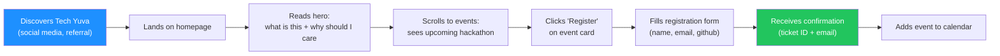
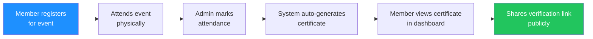
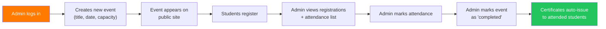
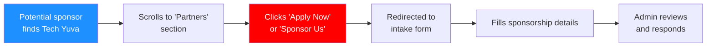
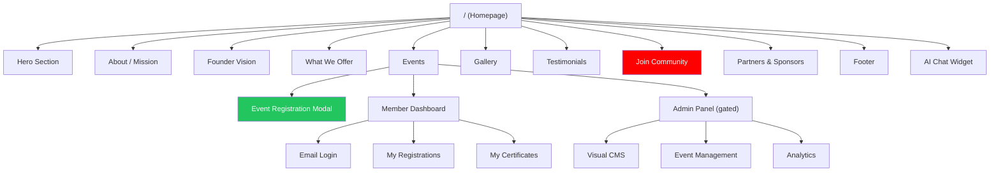

# 01 — PRODUCT VISION

> **Tech Yuva Engineering Bible** — Document 2 of 13  
> **Status:** Draft v1.0  
> **Last Updated:** 2026-07-12  
> **Owner:** Product & Engineering  
> **Classification:** Internal — Engineering  
> **Prerequisite:** [00_PROJECT_CONTEXT.md](./00_PROJECT_CONTEXT.md)

---

## 1. Product Thesis

**Tech Yuva exists to solve one problem:** student developers are stuck in tutorial hell with no path to production experience, real networking, or startup exposure.

**The hypothesis:** if you give students a structured pipeline — Learn (workshops) → Build (hackathons) → Pitch (accelerator nights) → Lead (community roles) — and make every touchpoint feel premium, they will self-organize into a high-output tech community that attracts sponsors, mentors, and employers organically.

**The platform's job** is to operationalize this pipeline: manage the events, track the people, issue the credentials, and lower the friction between "I found this community" and "I just registered for a hackathon."

---

## 2. Target Audience

### Primary: Student Developers (18–24)

| Attribute | Detail |
|-----------|--------|
| **Age** | 18–24 (primarily college undergraduates) |
| **Location** | India (NCR initially, expanding to Tier 1/2 cities) |
| **Device** | 70% mobile, 25% laptop, 5% tablet |
| **Tech Level** | Beginner to intermediate — can write code but haven't shipped production systems |
| **Motivation** | Resume differentiation, peer community, hackathon prizes, startup exposure |
| **Discovery** | Instagram, WhatsApp group invites, college peer referral, LinkedIn |
| **Attention Span** | < 8 seconds to understand value proposition. < 30 seconds to decide whether to register. |

### Secondary: Sponsors & Partners

| Attribute | Detail |
|-----------|--------|
| **Type** | Tech companies, dev tool startups, VCs, college administrations |
| **Motivation** | Talent pipeline access, brand visibility among Gen-Z developers |
| **Expectation** | Clear sponsorship tiers, measurable reach, professional communication |

### Tertiary: Mentors & Speakers

| Attribute | Detail |
|-----------|--------|
| **Type** | Industry engineers, startup founders, domain experts |
| **Motivation** | Community building, talent scouting, personal brand |
| **Expectation** | Organized events, respectful of their time, professional speaker pages |

---

## 3. User Journeys

### Journey A: First-Time Visitor → Event Registrant

This is the **primary conversion funnel** — the single most important flow in the product.



**Current state:** Steps A–F work. Step G shows a fake ticket but sends no email. Step H doesn't exist.

**Target time to completion:** < 90 seconds from landing to confirmed registration.

**Critical metrics:**
| Metric | Target | Current |
|--------|--------|---------|
| Hero → Scroll to Events | > 60% | Unknown (no analytics) |
| Event Card → Click Register | > 25% | Unknown |
| Open Form → Submit | > 70% | Unknown |
| Submit → Confirmed | 100% | Works (via API) |
| Confirmed → Receives Email | 100% | 0% (no email) |

### Journey B: Visitor → Community Member


**Current state:** Step D is **completely broken** — form fakes a submission with `setTimeout`. Data is thrown away. No API call. No email. No Discord invite. **This is the #1 P0 issue.**

### Journey C: Member → Certificate Holder



**Current state:** This flow works end-to-end in the database layer. The certificate generation triggers correctly when attendance is marked and the event status transitions to "completed." The verification endpoint (`/api/certificates/verify/:code`) returns certificate data. **This is the most complete feature in the product.**

### Journey D: Admin → Event Operator



**Current state:** This flow works mechanically but has **zero access control** — any visitor who knows the admin email (which is in the public source code) can perform all admin actions.

### Journey E: Sponsor → Partnership Intake



**Current state:** Step C links to literal placeholder strings. **Completely broken.** Zero sponsor intake capability.

---

## 4. Value Proposition Hierarchy

What users need to understand, in order, within the first 30 seconds:

| Priority | Message | Current Clarity |
|----------|---------|----------------|
| 1 | **What is Tech Yuva?** — A student tech community | ⚠️ Buried under jargon ("Innovation Guild," "Cohort Principles") |
| 2 | **What do you do?** — Hackathons, workshops, bootcamps | ✅ Clearly listed in "What We Offer" section |
| 3 | **What's happening next?** — [Specific event name + date] | ✅ Events section works well |
| 4 | **How do I join?** — One-click registration | ❌ Join form is broken |
| 5 | **Who else is here?** — Social proof (real members, real photos) | ❌ Fabricated testimonials and stock photos |
| 6 | **Is this legit?** — Trust signals (real sponsors, real history) | ❌ Fabricated sponsor list |

### Recommended Hero Structure

```
[Badge: "Next event: YuvaHack 2026 — July 15" ]

TECH YUVA
The student tech community for builders.

Hackathons. Workshops. Startup nights.
500+ members across [N] colleges.

[Register for YuvaHack →]    [Join the Community →]
```

**Design decision:** The hero should answer questions 1-4 in the table above. The current hero answers only question 1 (partially) and spends significant screen space on a code terminal simulator that has no functional purpose.

---

## 5. Feature Prioritization Matrix

Features are prioritized using the ICE framework: **Impact × Confidence × Ease**.

| Feature | Impact | Confidence | Ease | ICE Score | Priority |
|---------|--------|------------|------|-----------|----------|
| **Working Join Community form** | 10 | 10 | 9 | 900 | P0 |
| **Fix placeholder CTA URLs** | 8 | 10 | 10 | 800 | P0 |
| **Remove IdentitySwitcher from prod** | 9 | 10 | 10 | 900 | P0 |
| **Remove hardcoded admin email** | 9 | 10 | 9 | 810 | P0 |
| **Mobile hamburger navigation** | 9 | 10 | 8 | 720 | P0 |
| **Fix loading screen sessionStorage** | 7 | 10 | 10 | 700 | P1 |
| **Real testimonials** | 7 | 9 | 6 | 378 | P1 |
| **Real gallery photos** | 6 | 9 | 6 | 324 | P1 |
| **Email confirmation on registration** | 8 | 9 | 5 | 360 | P1 |
| **Fix OG image absolute URL** | 5 | 10 | 10 | 500 | P1 |
| **Discord invite integration** | 8 | 8 | 7 | 448 | P1 |
| **Plain-language copy rewrite** | 7 | 8 | 7 | 392 | P1 |
| **Auth system overhaul** | 9 | 8 | 4 | 288 | P2 |
| **Analytics dashboard** | 6 | 7 | 5 | 210 | P2 |
| **Multi-admin support** | 7 | 7 | 4 | 196 | P2 |
| **Public API** | 5 | 6 | 3 | 90 | P3 |
| **Mobile app** | 6 | 5 | 2 | 60 | P3 |
| **Multi-tenant (college chapters)** | 8 | 5 | 2 | 80 | P3 |

---

## 6. Success Metrics

### North Star Metric

**Monthly Active Registrations (MAR)** — the number of unique event registrations completed per month.

This metric captures the full value chain: user discovered the community → found a relevant event → trusted it enough to register. It is leading (predicts community health) and actionable (directly improved by better events, UX, and marketing).

### Primary KPIs

| Metric | Definition | V1 Target | Measurement |
|--------|-----------|-----------|-------------|
| **MAR** | Unique event registrations / month | 50 | Database query on `registrations` table |
| **Registration Conversion Rate** | (Registrations / Unique Visitors) × 100 | > 5% | Analytics + DB |
| **Event Attendance Rate** | (Attended / Registered) × 100 | > 60% | Admin attendance tracking |
| **Member Retention (30d)** | % of members who register for a 2nd event within 30 days | > 20% | DB query |
| **Time to Registration** | Seconds from first page load to confirmed registration | < 90s | Analytics |

### Secondary KPIs

| Metric | Definition | V1 Target |
|--------|-----------|-----------|
| **Bounce Rate** | % of visitors who leave without scrolling | < 40% |
| **Mobile Completion Rate** | % of mobile users who complete registration | > 50% |
| **Certificate Issuance Rate** | Certificates issued / Attended × 100 | 100% |
| **Sponsor Inquiry Rate** | Sponsor form submissions / month | > 2 |
| **AI Chat Engagement** | % of visitors who interact with YuvaAI | > 10% |

### Anti-Metrics (Things We Don't Optimize For)

| Anti-Metric | Why We Ignore It |
|-------------|-----------------|
| **Time on site** | A fast registration is better than a long browse session |
| **Page views per session** | Single-page app — this number is meaningless |
| **AI chat messages per user** | More messages may indicate confusion, not engagement |
| **Total user count** | Vanity metric. A registered user who never attends is worth zero. |

---

## 7. Product Principles

These are the guardrails for every product decision. When two options are equally valid, choose the one that better satisfies these principles.

| # | Principle | Implication |
|---|-----------|------------|
| 1 | **Registration is the product** | Every pixel should reduce friction between "I'm curious" and "I'm registered." Features that don't serve this goal are deprioritized. |
| 2 | **Real over impressive** | Real photos > stock photos. Real numbers > inflated numbers. Real testimonials > fabricated ones. A smaller true number builds more trust than a larger fake one. |
| 3 | **Mobile-first, always** | If it doesn't work on a 360px screen with a thumb, it doesn't ship. The terminal code simulator in the hero is a desktop luxury — the mobile hero must be pure content. |
| 4 | **Plain language** | "Register" not "SECURE MY CODE PASS." "Events" not "COHORT REGISTRY DESK." Write for a 19-year-old CS student, not for a Y Combinator demo day audience. |
| 5 | **Earn trust before asking for data** | Show value (events, community proof, founder story) before asking for name/email. The registration form should come after the pitch, not before. |
| 6 | **One community, run well** | Don't build multi-tenant, multi-college, multi-everything before the first community has 500 real, active members. Premature scaling abstractions slow down iteration. |
| 7 | **Admin efficiency over admin aesthetics** | The admin panel should be fast and functional. It doesn't need animations, terminal emulators, or glass effects. Admins care about speed, not vibes. |

---

## 8. Competitive Landscape

| Competitor | What They Do | How Tech Yuva Differs |
|------------|-------------|----------------------|
| **Devfolio** | Hackathon discovery and registration | Devfolio is a marketplace for hackathons across India. Tech Yuva is a single community's operational platform. Different scope entirely. |
| **Luma** | Event management with beautiful pages | Luma is generic event hosting. Tech Yuva is purpose-built for tech community lifecycle (events + members + certificates + AI). |
| **Guild.xyz** | Token-gated community management | Web3-focused. Tech Yuva is Web2 with optional Web3 tracks. Different audience. |
| **Meetup** | Local event discovery | Meetup is discovery-focused. Tech Yuva is operations-focused (registration, attendance, certificates, CMS). |
| **Custom college club websites** | Static WordPress/Hugo sites | No database, no registration, no certificates, no AI. Tech Yuva is the full-stack upgrade. |

**Competitive advantage:** The combination of event management + member lifecycle + automated certificates + CMS + AI assistant in a single platform designed specifically for student tech communities. No existing product combines all of these.

**Competitive risk:** At current scale (pre-launch, 0 real users), there is no moat. The moat is built by having the first 500 members and 10 successful events. The platform is a tool; the community is the product.

---

## 9. Content Strategy

### Brand Voice (Target State)

| Attribute | Current | Target |
|-----------|---------|--------|
| **Tone** | Corporate-tech, theatrical, jargon-heavy | Confident, friendly, technical but approachable |
| **Register** | "SECURE MY CODE PASS" | "Register Now" |
| **Events** | "COHORT REGISTRY DESK" | "Upcoming Events" |
| **Testimonials** | "FELLOWSHIP VERDICTS" | "What Members Say" |
| **Sponsors** | "ECOSYSTEM COMPILER PARTNERS" | "Our Partners" |
| **Admin** | "ADMINISTRATOR COMMAND DECK" | "Admin Dashboard" |
| **Email field** | "Secure Email ID" | "Email" |
| **Close button** | "DISMISS PASSPORT" | "Close" |

**Rule of thumb:** If your mother wouldn't understand the label, rewrite it.

### Content Authenticity Requirements

| Content Type | Requirement |
|-------------|-------------|
| **Testimonials** | Must be from real members with real photos. Written consent required. Minimum 3 testimonials. |
| **Gallery** | Must be photos from actual Tech Yuva events. No stock photography. |
| **Statistics** | Must reflect actual database counts or verifiable claims. |
| **Sponsors** | Only list confirmed sponsors with written agreements. |
| **Founder bio** | Must be accurate and current. |

---

## 10. Information Architecture

### Sitemap (V1)



> [!WARNING]
> The "Join Community" node is red because it is currently non-functional. This is the single most important conversion endpoint on the site.

### Navigation Structure

| Link | Scrolls To / Opens | Visible On |
|------|-------------------|-----------|
| Mission | About section | Desktop nav |
| Ecosystem | Offerings section | Desktop nav |
| Events | Events section | Desktop nav |
| Community | Gallery section | Desktop nav |
| Join Community | Join form section | Desktop nav + mobile (hamburger) |

### Missing Navigation (V1 Requirements)

| Item | Purpose | Priority |
|------|---------|----------|
| **Mobile hamburger menu** | Access all nav items on mobile | P0 |
| **Privacy Policy** | Legal compliance | P1 |
| **Terms of Service** | Legal compliance | P2 |

---

## Current Status

| Attribute | Value |
|-----------|-------|
| **Document Status** | Complete — Draft v1.0 |
| **Product Status** | Pre-launch. 5 P0 issues blocking launch. No real users. No analytics. |
| **Content Status** | Fabricated social proof (testimonials, sponsors, gallery). Must be replaced with real content before launch. |

## Dependencies

| Dependency | Required For | Status |
|------------|-------------|--------|
| 00_PROJECT_CONTEXT.md | Context for all decisions in this doc | ✅ Complete |
| Product audit findings | P0/P1 issue prioritization | ✅ Complete (2026-07-12) |
| Real event photos | Gallery section | ❌ Not available |
| Real member testimonials | Testimonials section | ❌ Not collected |
| Confirmed sponsor agreements | Sponsor section | ❌ Not confirmed |

## Implementation Priority

This document informs priorities across all implementation documents. The key takeaways for engineering:

1. **Fix the Join Community form** — this is the product's reason for existing.
2. **Fix mobile navigation** — 70% of the audience can't navigate.
3. **Remove dev tools from production** — IdentitySwitcher, hardcoded emails.
4. **Implement real auth** — before any public launch.
5. **Rewrite copy** — before any marketing push.

## Future Improvements

1. **User research** — Conduct 5 usability tests with actual target students before launch.
2. **A/B testing framework** — Test hero variants, CTA copy, and registration flow.
3. **Referral system** — Member-invites-member with tracking.
4. **Waitlist mode** — For events at capacity, capture interest for future events.
5. **Public roadmap** — A changelog or "what's coming" page for community transparency.

## Related Documents

- `00_PROJECT_CONTEXT.md` — Foundation this vision is built on
- `02_ARCHITECTURE.md` — Technical architecture implementing this vision
- `06_EVENTS.md` — Detailed event lifecycle (Journey C and D)
- `09_SECURITY.md` — Auth and RBAC requirements derived from Journey D
- `12_ROADMAP.md` — Phased execution plan implementing this priority matrix
