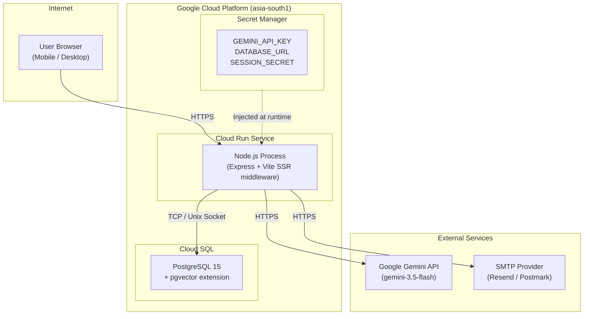
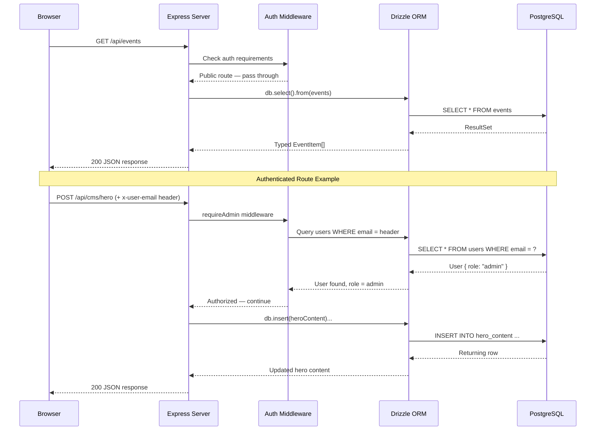
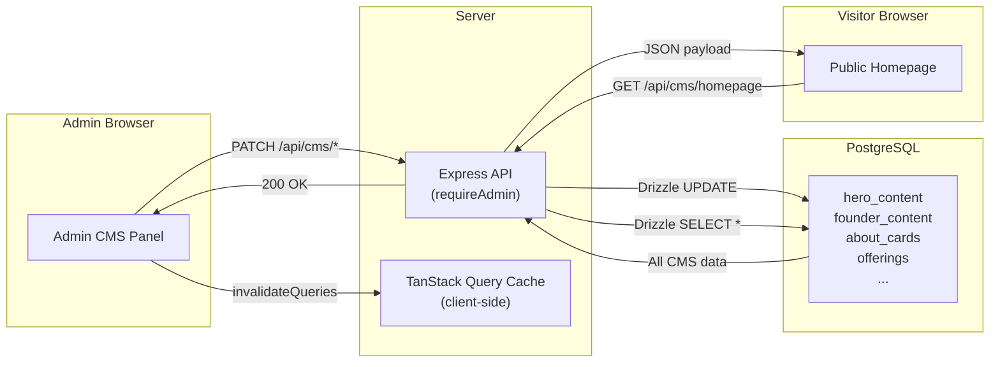
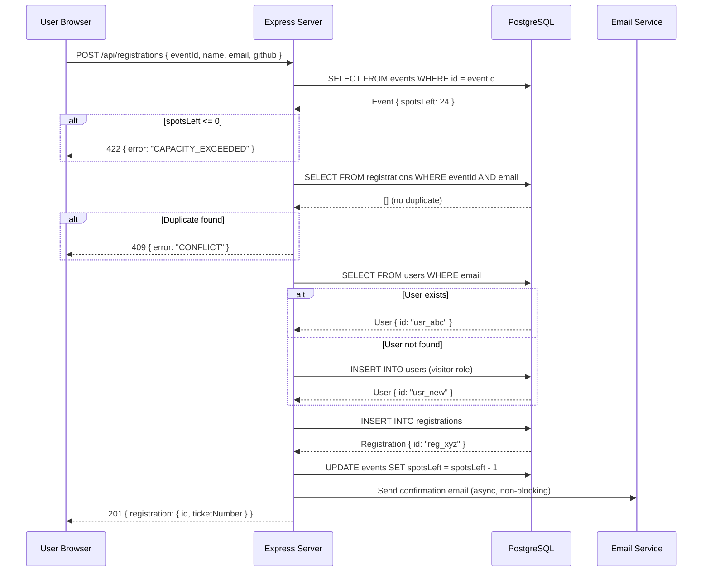
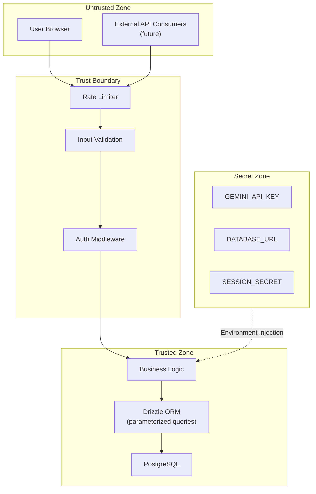

# 02 — ARCHITECTURE

> **Tech Yuva Engineering Bible** — Document 3 of 13  
> **Status:** Draft v1.0  
> **Last Updated:** 2026-07-12  
> **Owner:** Engineering  
> **Classification:** Internal — Engineering  
> **Prerequisites:** [00_PROJECT_CONTEXT.md](./00_PROJECT_CONTEXT.md), [01_PRODUCT_VISION.md](./01_PRODUCT_VISION.md)

---

## 1. Architecture Philosophy

### Guiding Principles

| Principle | Implication |
|-----------|------------|
| **Monolith-first** | Single deployable unit. No microservices until a measured bottleneck demands extraction. |
| **Boring technology** | PostgreSQL, Express, React. No bleeding-edge infrastructure. |
| **Server-authoritative** | All business logic runs server-side. The client is a rendering layer. |
| **Stateless server** | No in-memory sessions. All state lives in PostgreSQL. Enables horizontal scaling on Cloud Run. |
| **Type-safe end-to-end** | TypeScript on both client and server. Drizzle ORM for compile-time query safety. |
| **Progressive enhancement** | Core flows (registration, event listing) must work without JavaScript animations. AI chat is an enhancement. |

### What We Will NOT Build

| Anti-Pattern | Why Not |
|-------------|---------|
| GraphQL | REST covers all current use cases. No deeply nested queries. GraphQL adds complexity without value at this scale. |
| WebSockets | No real-time requirements in V1. Polling via TanStack Query (30s default) is sufficient. |
| Message queues | No async job processing needed. Certificate generation is synchronous and fast (< 100ms). |
| CDN-first architecture | Static assets are small (< 5MB total). Cloud Run serves them adequately. CDN can be added later via a Cloudflare proxy. |
| Server-Side Rendering | No SEO requirements for authenticated pages. The public landing page could benefit from SSR in V2, but it's not worth the complexity now. |

---

## 2. System Architecture

### Production Topology



### Request Flow



---

## 3. Server Decomposition Plan

### Current State: Single File (1,257 Lines)

The entire backend lives in `server.ts`. This file contains:

| Concern | Lines (approx) | Route Count |
|---------|----------------|-------------|
| Server bootstrap + middleware | 1–78 | 0 |
| Auth routes | 83–176 | 3 |
| Event CRUD | 178–307 | 4 |
| Registration CRUD | 309–423 | 2 |
| Attendance tracking | 425–477 | 1 |
| Certificate routes | 479–526 | 2 |
| AI Chat | 530–612 | 1 |
| CMS Admin middleware | 618–639 | 0 |
| CMS Homepage (public) | 641–672 | 1 |
| CMS Hero/Founder/SEO/Site | 674–798 | 4 |
| CMS About/Offerings/Gallery | 800–957 | 9 |
| CMS Sponsors/Testimonials/Announcements | 959–1126 | 9 |
| CMS Media Library | 1128–1177 | 3 |
| CMS Analytics | 1179–1230 | 1 |
| Vite integration + server start | 1232–1257 | 0 |
| **Total** | **1,257** | **40** |

### Target State: Route Modules

```
server/
├── index.ts                  # Express app creation, middleware, Vite integration, listen()
├── middleware/
│   ├── auth.ts               # requireAdmin, requireMember, requireAuth
│   ├── validate.ts           # Request body validation helpers
│   └── rateLimit.ts          # Rate limiting per endpoint group
├── routes/
│   ├── auth.routes.ts        # POST /api/auth/login, /api/auth/register
│   ├── events.routes.ts      # CRUD /api/events
│   ├── registrations.routes.ts  # CRUD /api/registrations, attendance
│   ├── certificates.routes.ts   # GET /api/certificates, verify
│   ├── chat.routes.ts        # POST /api/chat (AI assistant)
│   └── cms/
│       ├── public.routes.ts  # GET /api/cms/homepage
│       ├── hero.routes.ts    # PATCH /api/cms/hero
│       ├── founder.routes.ts # PATCH /api/cms/founder
│       ├── seo.routes.ts     # PATCH /api/cms/seo
│       ├── site.routes.ts    # PATCH /api/cms/site
│       ├── about.routes.ts   # CRUD /api/cms/about
│       ├── offerings.routes.ts  # CRUD /api/cms/offerings
│       ├── gallery.routes.ts    # CRUD /api/cms/gallery
│       ├── sponsors.routes.ts   # CRUD /api/cms/sponsors
│       ├── testimonials.routes.ts # CRUD /api/cms/testimonials
│       ├── announcements.routes.ts # CRUD /api/cms/announcements
│       ├── media.routes.ts      # CRUD /api/cms/media
│       └── analytics.routes.ts  # GET /api/cms/analytics
├── services/
│   ├── ai.service.ts         # Gemini client init, RAG search, chat generation
│   ├── certificate.service.ts # Certificate generation logic
│   └── email.service.ts      # Email sending (registration confirmations)
└── lib/
    ├── id.ts                 # ID generation (replace Date.now() with nanoid/cuid)
    └── errors.ts             # Standardized error response helpers
```

**Decomposition rules:**

1. Each route file exports a single `Router` instance.
2. Route files contain zero business logic — they validate input, call a service or ORM query, and return a response.
3. Business logic that spans multiple tables lives in `services/`.
4. The `index.ts` file imports all routers and mounts them with `app.use()`.

**Migration strategy:** This is a refactoring, not a rewrite. Move routes one group at a time. Each group gets its own PR. Tests for each group are written during extraction. Estimated effort: 2-3 days.

---

## 4. Client Decomposition Plan

### Current State: Single Component (1,240 Lines)

`App.tsx` renders every section of the site in a single component with 15+ state variables. No routing. No code splitting.

| Section | Lines (approx) | Should Be |
|---------|----------------|-----------|
| Imports + state declarations | 1–161 | Stays in App.tsx (reduced) |
| Header/Nav | 194–249 | `components/layout/Header.tsx` |
| Hero | 254–267 | Already extracted (`HeroTerminal.tsx`) |
| About / Mission | 269–390 | `sections/AboutSection.tsx` |
| Founder Vision | 392–401 | Already extracted (`FounderVision.tsx`) |
| Offerings Bento Grid | 403–524 | `sections/OfferingsSection.tsx` |
| Events Hub (tabs, cards, admin) | 526–767 | `sections/EventsSection.tsx` + sub-components |
| Gallery + Stats | 769–871 | `sections/GallerySection.tsx` |
| Sponsors Marquee | 873–925 | `sections/SponsorsSection.tsx` |
| Testimonials | 927–989 | `sections/TestimonialsSection.tsx` |
| Join Community CTA | 991–1102 | `sections/JoinSection.tsx` |
| Partner/Volunteer CTA | 1106–1155 | `sections/PartnerCTA.tsx` |
| Footer | 1157–1212 | `components/layout/Footer.tsx` |
| Floating Components | 1214–1234 | Stays in App.tsx |

### Target State: Route-Based Architecture

```
src/
├── main.tsx                  # React DOM entry, QueryClient, Router
├── App.tsx                   # Layout shell (Header + Outlet + Footer + Floating)
├── types.ts                  # Shared TypeScript interfaces
├── data.ts                   # Static fallback data
│
├── hooks/
│   ├── useEvents.ts          # TanStack Query hook for events
│   ├── useRegistrations.ts   # TanStack Query hook for registrations
│   ├── useCMS.ts             # TanStack Query hook for CMS data
│   └── useAuth.ts            # Auth state management (context + API calls)
│
├── components/
│   ├── layout/
│   │   ├── Header.tsx        # Nav bar with mobile hamburger
│   │   └── Footer.tsx        # Site footer
│   ├── ui/
│   │   ├── BlurredImage.tsx
│   │   ├── TechYuvaLogo.tsx
│   │   └── LoadingScreen.tsx
│   └── modals/
│       ├── EventRegisterModal.tsx
│       └── CertificateViewer.tsx
│
├── sections/                 # Homepage sections (scroll-anchored)
│   ├── HeroSection.tsx       # Includes HeroTerminal
│   ├── AboutSection.tsx
│   ├── FounderSection.tsx
│   ├── OfferingsSection.tsx
│   ├── EventsSection.tsx     # Tabs: Upcoming / Member / Admin
│   ├── GallerySection.tsx
│   ├── SponsorsSection.tsx
│   ├── TestimonialsSection.tsx
│   ├── JoinSection.tsx
│   └── PartnerCTA.tsx
│
├── pages/                    # Future: when routing is added
│   ├── HomePage.tsx          # Assembles all sections
│   ├── PrivacyPage.tsx
│   └── TermsPage.tsx
│
└── contexts/
    └── AuthContext.tsx        # Current user state + role
```

**Migration strategy:** Extract one section at a time, starting from the bottom (Footer → JoinSection → TestimonialsSection → upward). Each extraction is a single commit. No behavior changes during extraction.

---

## 5. REST API Specification

### API Design Conventions

| Convention | Rule |
|------------|------|
| **Base path** | `/api` |
| **Content type** | `application/json` for all requests and responses |
| **HTTP methods** | `GET` (read), `POST` (create), `PATCH` (partial update), `DELETE` (remove) |
| **ID format** | Prefixed nanoid: `usr_`, `evt_`, `reg_`, `cert_`, `ann_`, etc. |
| **Timestamps** | ISO 8601 strings in UTC: `2026-07-15T10:00:00.000Z` |
| **Error format** | `{ "error": "Human-readable message", "code": "MACHINE_CODE" }` |
| **Pagination** | `?page=1&limit=20` on list endpoints. Response: `{ data: [], meta: { page, limit, total } }` |
| **Auth header** | `Authorization: Bearer <session_token>` (replaces current `x-user-email`) |

### Error Codes

| HTTP Status | Code | Meaning |
|-------------|------|---------|
| 400 | `VALIDATION_ERROR` | Missing or invalid request body fields |
| 401 | `UNAUTHENTICATED` | No valid session token provided |
| 403 | `FORBIDDEN` | Valid session but insufficient role |
| 404 | `NOT_FOUND` | Resource does not exist |
| 409 | `CONFLICT` | Duplicate resource (e.g., already registered) |
| 422 | `CAPACITY_EXCEEDED` | Event has no remaining spots |
| 429 | `RATE_LIMITED` | Too many requests |
| 500 | `INTERNAL_ERROR` | Unexpected server error |

### Endpoint Catalog

#### Authentication

| Method | Path | Auth | Description |
|--------|------|------|-------------|
| `POST` | `/api/auth/register` | None | Create account (name, email, github) |
| `POST` | `/api/auth/login` | None | Login by email (sends magic link or OTP) |
| `POST` | `/api/auth/verify` | None | Verify magic link / OTP token → returns session |
| `POST` | `/api/auth/logout` | Session | Invalidate session |
| `GET` | `/api/auth/me` | Session | Return current user profile |

#### Events

| Method | Path | Auth | Description |
|--------|------|------|-------------|
| `GET` | `/api/events` | None | List all events (filterable by status) |
| `GET` | `/api/events/:id` | None | Get single event details |
| `POST` | `/api/events` | Admin | Create a new event |
| `PATCH` | `/api/events/:id` | Admin | Update event fields |
| `DELETE` | `/api/events/:id` | Admin | Delete event (cascades to registrations) |

#### Registrations

| Method | Path | Auth | Description |
|--------|------|------|-------------|
| `GET` | `/api/registrations` | Admin | List all registrations (filterable by event, user) |
| `GET` | `/api/registrations/mine` | Session | List current user's registrations |
| `POST` | `/api/registrations` | None* | Register for an event |
| `PATCH` | `/api/registrations/:id/attend` | Admin | Mark attendance (true/false) |
| `DELETE` | `/api/registrations/:id` | Admin | Cancel a registration |

> *Registration creates or links a user account automatically. See [06_EVENTS.md](./06_EVENTS.md) for the full registration flow.

#### Certificates

| Method | Path | Auth | Description |
|--------|------|------|-------------|
| `GET` | `/api/certificates` | Admin | List all certificates |
| `GET` | `/api/certificates/mine` | Session | List current user's certificates |
| `GET` | `/api/certificates/verify/:code` | None | Public verification endpoint |

#### AI Chat

| Method | Path | Auth | Description |
|--------|------|------|-------------|
| `POST` | `/api/chat` | None | Send message, receive AI response |

#### CMS (Public)

| Method | Path | Auth | Description |
|--------|------|------|-------------|
| `GET` | `/api/cms/homepage` | None | All homepage dynamic content in one payload |

#### CMS (Admin)

| Method | Path | Auth | Description |
|--------|------|------|-------------|
| `PATCH` | `/api/cms/hero` | Admin | Update hero section content |
| `PATCH` | `/api/cms/founder` | Admin | Update founder section content |
| `PATCH` | `/api/cms/seo` | Admin | Update SEO metadata |
| `PATCH` | `/api/cms/site` | Admin | Update global site settings |
| `POST` | `/api/cms/about` | Admin | Create about card |
| `PATCH` | `/api/cms/about/:id` | Admin | Update about card |
| `DELETE` | `/api/cms/about/:id` | Admin | Delete about card |
| `POST` | `/api/cms/offerings` | Admin | Create offering |
| `PATCH` | `/api/cms/offerings/:id` | Admin | Update offering |
| `DELETE` | `/api/cms/offerings/:id` | Admin | Delete offering |
| `POST` | `/api/cms/gallery` | Admin | Create gallery item |
| `PATCH` | `/api/cms/gallery/:id` | Admin | Update gallery item |
| `DELETE` | `/api/cms/gallery/:id` | Admin | Delete gallery item |
| `POST` | `/api/cms/sponsors` | Admin | Create sponsor |
| `PATCH` | `/api/cms/sponsors/:id` | Admin | Update sponsor |
| `DELETE` | `/api/cms/sponsors/:id` | Admin | Delete sponsor |
| `POST` | `/api/cms/testimonials` | Admin | Create testimonial |
| `PATCH` | `/api/cms/testimonials/:id` | Admin | Update testimonial |
| `DELETE` | `/api/cms/testimonials/:id` | Admin | Delete testimonial |
| `POST` | `/api/cms/announcements` | Admin | Create announcement |
| `PATCH` | `/api/cms/announcements/:id` | Admin | Update announcement |
| `DELETE` | `/api/cms/announcements/:id` | Admin | Delete announcement |
| `GET` | `/api/cms/media` | Admin | List media library |
| `POST` | `/api/cms/media` | Admin | Upload media reference |
| `DELETE` | `/api/cms/media/:id` | Admin | Delete media item |
| `GET` | `/api/cms/analytics` | Admin | Dashboard analytics data |

**Total: 40 endpoints** (matches current implementation count; the change is structural, not functional).

---

## 6. Data Flow Architecture

### CMS Content Flow



**Design decision:** The CMS homepage endpoint (`GET /api/cms/homepage`) returns ALL CMS data in a single request (hero, founder, about cards, offerings, gallery, sponsors, testimonials, announcements). This is intentional:

1. **One round trip** — The homepage needs all this data. 10 separate requests would be slower than 1 combined request.
2. **Simple caching** — TanStack Query caches the single response. Invalidation is straightforward.
3. **Trade-off:** The response payload is ~15-30KB. This is well within acceptable limits for a single API call.
4. **When to split:** If individual CMS sections start being used on separate pages (e.g., a standalone events page), extract those sections into dedicated endpoints.

### Event Registration Flow



> [!WARNING]
> **Race condition:** The current `spotsLeft` decrement is not atomic. Under concurrent registrations, two users could both read `spotsLeft = 1`, both pass the check, and both register — resulting in `spotsLeft = -1`. The fix is documented in [03_DATABASE.md](./03_DATABASE.md) (use `UPDATE events SET spots_left = spots_left - 1 WHERE spots_left > 0 RETURNING spots_left`).

---

## 7. ID Generation Strategy

### Current Problem

All IDs are generated with `Date.now()`:

```typescript
// Current — collision-prone
id: `u-${Date.now()}`    // Users
id: `e-${Date.now()}`    // Events
id: `r-${Date.now()}`    // Registrations
id: `cert-${Date.now()}` // Certificates
```

Two concurrent requests within the same millisecond produce identical IDs → database constraint violation → 500 error.

### Target: Prefixed nanoid

| Entity | Prefix | Example | Generator |
|--------|--------|---------|-----------|
| User | `usr_` | `usr_V1StGXR8_Z5jdHi6B` | `nanoid(21)` |
| Event | `evt_` | `evt_2b4f3e8a_kLm9` | `nanoid(21)` |
| Registration | `reg_` | `reg_Xp2s5v8y_Rq3w` | `nanoid(21)` |
| Certificate | `cert_` | `cert_7Hb3kA_mN9pQ` | `nanoid(21)` |
| About Card | `abt_` | `abt_jK2mN_8pLq` | `nanoid(21)` |
| Offering | `off_` | `off_3Rt5Yw_6Xz` | `nanoid(21)` |
| Gallery Item | `gal_` | `gal_9Mn2Kp_4Jh` | `nanoid(21)` |
| Sponsor | `sps_` | `sps_1Qw3Er_5Ty` | `nanoid(21)` |
| Testimonial | `tes_` | `tes_6Ui8Op_2As` | `nanoid(21)` |
| Announcement | `ann_` | `ann_4Df6Gh_7Jk` | `nanoid(21)` |
| Media | `med_` | `med_8Zx0Cv_1Bn` | `nanoid(21)` |
| Knowledge Chunk | `kb_` | `kb_5Nm7Lp_3Qr` | `nanoid(21)` |

**Why nanoid over UUID:**
- Shorter (21 chars vs 36 chars) → smaller indexes, better URL readability
- URL-safe alphabet by default
- 1 billion IDs needed before 1% probability of a single collision
- Zero dependencies (< 200 bytes)

**Implementation:** Create `server/lib/id.ts`:

```typescript
// Conceptual — not implementation code
export function generateId(prefix: string): string {
  return `${prefix}_${nanoid(21)}`;
}
```

---

## 8. Caching Strategy

### Client-Side (TanStack Query)

| Query Key | Stale Time | Refetch Interval | Cache Time | Rationale |
|-----------|-----------|-------------------|------------|-----------|
| `["events"]` | 30s | 60s | 5min | Events change infrequently. Near-real-time isn't needed. |
| `["registrations"]` | 10s | 30s | 5min | Registration counts change when users register. |
| `["cmsData"]` | 60s | 120s | 10min | CMS content changes only when admin edits. |
| `["certificates"]` | 60s | None | 10min | Certificates are issued once and rarely change. |
| `["analytics"]` | 30s | 60s | 5min | Admin dashboard. Moderate freshness needed. |

### Server-Side Caching (V2)

No server-side caching in V1. The PostgreSQL query execution time for all current queries is < 10ms. Server-side caching introduces invalidation complexity that isn't justified.

**When to add server-side caching:**
- When `GET /api/cms/homepage` response time exceeds 100ms (it currently does 8 separate queries)
- When the same data is requested > 100 times/second
- Implementation: In-memory LRU cache with 60-second TTL, invalidated on any CMS PATCH/POST/DELETE

---

## 9. Performance Budget

### Page Load Targets

| Metric | Target | Current (estimated) | Notes |
|--------|--------|-------------------|-------|
| **First Contentful Paint (FCP)** | < 1.5s | ~12s (blocked by loading screen) | Loading screen must be removed or reduced |
| **Largest Contentful Paint (LCP)** | < 2.5s | ~14s | Same — loading screen |
| **Time to Interactive (TTI)** | < 3.0s | ~15s | Same |
| **Cumulative Layout Shift (CLS)** | < 0.1 | Unknown | Gallery images without dimensions may cause CLS |
| **Total JS Bundle** | < 200KB (gzipped) | ~180KB (estimated) | Motion library is ~15KB, React ~45KB, app ~120KB |
| **Total Transfer Size** | < 500KB (excluding video) | ~3.5MB (loading video is 3MB) | Video must be removed or lazy-loaded |

### API Response Time Targets

| Endpoint | Target | Current |
|----------|--------|---------|
| `GET /api/events` | < 50ms | ~10ms |
| `GET /api/cms/homepage` | < 100ms | ~30ms (8 queries) |
| `POST /api/registrations` | < 200ms | ~50ms |
| `POST /api/chat` (with Gemini) | < 5s | ~2-4s |
| `POST /api/chat` (fallback/no key) | < 100ms | ~20ms |

---

## 10. Security Architecture

> Full details in [09_SECURITY.md](./09_SECURITY.md). This section covers architectural security boundaries only.

### Trust Boundaries



### Critical Security Requirements

| Requirement | Current State | Target State |
|-------------|--------------|--------------|
| **No API keys in client bundle** | ✅ Gemini key is server-only | Maintain |
| **No admin credentials in client** | ❌ Email hardcoded in App.tsx | Remove. Use session-based auth. |
| **Auth on admin endpoints** | ⚠️ `x-user-email` header (spoofable) | Session token with server-side validation |
| **Auth on sensitive public endpoints** | ❌ `/api/users` exposes all user data | Add auth or remove endpoint |
| **Input validation** | ❌ No validation beyond `required` checks | Zod schemas on all POST/PATCH bodies |
| **Rate limiting** | ❌ None | 100 req/min per IP on auth, 10 req/min on chat |
| **SQL injection** | ✅ Drizzle uses parameterized queries | Maintain |
| **XSS** | ⚠️ React auto-escapes, but `dangerouslySetInnerHTML` is not used (good) | Add CSP headers |
| **CORS** | ❌ No CORS configured (implicit same-origin) | Explicit CORS for production domain |

---

## 11. Testing Strategy

### Test Pyramid

```
        ╱╲
       ╱ E2E ╲          5-10 tests (Playwright)
      ╱────────╲         Critical user journeys
     ╱Integration╲       20-30 tests (Vitest + supertest)
    ╱──────────────╲     API route tests with real DB
   ╱   Unit Tests    ╲   50-100 tests (Vitest)
  ╱────────────────────╲ Pure functions, services, validators
```

| Layer | Framework | What to Test | Count Target |
|-------|-----------|-------------|-------------|
| **Unit** | Vitest | ID generation, certificate code generation, input validators, date utils | 50-100 |
| **Integration** | Vitest + supertest | API routes: correct status codes, auth enforcement, DB state changes | 20-30 |
| **E2E** | Playwright | Journey A (visitor → registration), Journey D (admin → event creation) | 5-10 |

### Test Tooling

| Tool | Purpose |
|------|---------|
| `vitest` | Test runner (fast, Vite-native, TypeScript support) |
| `supertest` | HTTP assertion library for Express routes |
| `playwright` | Browser automation for E2E tests |
| `@faker-js/faker` | Test data generation |

### Test Database

- Use a separate PostgreSQL database for tests (same schema, different name).
- Run `drizzle-kit push` before test suite to sync schema.
- Truncate all tables between test files (not between individual tests — too slow).
- Do NOT mock the database. Integration tests should hit a real PostgreSQL instance.

---

## 12. Observability

### Logging

| Level | Use Case | Example |
|-------|----------|---------|
| `error` | Unexpected failures, unhandled exceptions | Database connection failure |
| `warn` | Recoverable issues, missing optional config | Gemini API key not set |
| `info` | Request lifecycle, business events | Registration created, event completed |
| `debug` | Detailed execution flow (dev only) | RAG search scores, query timing |

**Format:** Structured JSON logs for production (parseable by Cloud Logging). Human-readable for development.

### Health Check

| Endpoint | Method | Purpose |
|----------|--------|---------|
| `GET /api/health` | None | Returns `{ status: "ok", timestamp, db: "connected" }` |
| `GET /api/health/ready` | None | Checks DB connectivity + Gemini API availability |

Cloud Run uses `/api/health` as the startup probe and liveness check.

### Metrics (V2)

| Metric | Type | Purpose |
|--------|------|---------|
| `http_requests_total` | Counter | Total requests by method, path, status |
| `http_request_duration_seconds` | Histogram | Response time distribution |
| `db_query_duration_seconds` | Histogram | Database query performance |
| `registrations_total` | Counter | Business metric — total registrations |
| `ai_chat_requests_total` | Counter | AI usage tracking |

---

## 13. Deployment Architecture

> Full details in [11_DEPLOYMENT.md](./11_DEPLOYMENT.md). This section covers the architectural view.

### Environments

| Environment | Purpose | Infrastructure | URL |
|-------------|---------|---------------|-----|
| `local` | Development | Docker Compose (Node + PostgreSQL) | `http://localhost:3000` |
| `preview` | PR previews | Cloud Run (auto-deployed per PR) | `https://pr-{N}.techyuva.dev` |
| `staging` | Pre-production validation | Cloud Run (asia-south1) | `https://staging.techyuva.org` |
| `production` | Live site | Cloud Run (asia-south1) | `https://techyuva.org` |

### Build Pipeline

```mermaid
graph LR
    A["git push"] --> B["GitHub Actions"]
    B --> C["TypeScript Check<br/>(tsc --noEmit)"]
    C --> D["Unit + Integration Tests<br/>(vitest)"]
    D --> E["Vite Build<br/>(client bundle)"]
    E --> F["esbuild<br/>(server bundle)"]
    F --> G["Docker Build"]
    G --> H["Push to Artifact Registry"]
    H --> I["Deploy to Cloud Run"]
    I --> J["Health Check"]
    J --> K["Traffic Migration<br/>(100% to new revision)"]
```



---

## Current Status

| Attribute | Value |
|-----------|-------|
| **Document Status** | Complete — Draft v1.0 |
| **Server Decomposition** | Not started. `server.ts` remains monolithic (1,257 lines). |
| **Client Decomposition** | Not started. `App.tsx` remains monolithic (1,240 lines). |
| **API Conventions** | Not enforced. Current API uses inconsistent ID formats, no pagination, no standard error codes. |
| **Testing** | Zero tests exist. No test framework installed. |
| **Observability** | `console.log` / `console.error` only. No structured logging. No health endpoint. |

## Dependencies

| Dependency | Required For | Status |
|------------|-------------|--------|
| `nanoid` | ID generation | Not installed |
| `zod` | Input validation | Not installed |
| `vitest` | Unit + integration testing | Not installed |
| `supertest` | API route testing | Not installed |
| `playwright` | E2E testing | Not installed |

## Implementation Priority

| Task | Priority | Effort | Document Reference |
|------|----------|--------|--------------------|
| Server route decomposition | P1 | 2-3 days | Section 3 |
| ID generation migration | P1 | 0.5 days | Section 7 |
| Client section extraction | P2 | 2-3 days | Section 4 |
| API convention enforcement | P2 | 1-2 days | Section 5 |
| Test infrastructure setup | P1 | 1 day | Section 11 |
| Health check endpoint | P1 | 0.5 days | Section 12 |
| Structured logging | P2 | 1 day | Section 12 |

## Future Improvements

1. **API versioning** — Prefix all routes with `/api/v1/` when public API is introduced (V3).
2. **OpenAPI spec** — Auto-generate from Zod schemas using `zod-to-openapi`.
3. **WebSocket support** — For real-time event dashboards and live registration counts (V2).
4. **Edge caching** — Cloudflare or Cloud CDN for static assets and public API responses.
5. **Background jobs** — Bull/BullMQ for email sending, certificate PDF generation (V2).
6. **Micro-frontend extraction** — Admin CMS as a separate bundle, lazy-loaded only for admin users (V3).

## Related Documents

- `00_PROJECT_CONTEXT.md` — Tech stack and constraints this architecture builds on
- `01_PRODUCT_VISION.md` — User journeys this architecture supports
- `03_DATABASE.md` — Schema design, indexing, and migration strategy
- `04_AUTH_SYSTEM.md` — Auth middleware and session management detailed here
- `09_SECURITY.md` — Full threat model and security controls
- `11_DEPLOYMENT.md` — CI/CD pipeline and environment configuration
