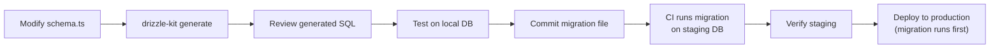

# 03 — DATABASE

> **Tech Yuva Engineering Bible** — Document 4 of 13  
> **Status:** Draft v1.0  
> **Last Updated:** 2026-07-12  
> **Owner:** Engineering  
> **Classification:** Internal — Engineering  
> **Prerequisites:** [00_PROJECT_CONTEXT.md](./00_PROJECT_CONTEXT.md), [02_ARCHITECTURE.md](./02_ARCHITECTURE.md)

---

## 1. Database Selection

| Attribute | Value |
|-----------|-------|
| **Engine** | PostgreSQL 15+ |
| **Provider** | Google Cloud SQL |
| **Region** | `asia-south1` (Mumbai) |
| **ORM** | Drizzle ORM 0.45.x |
| **Migration Tool** | drizzle-kit 0.31.x |
| **Extensions Required** | `pgvector` (vector similarity search for RAG) |

### Why PostgreSQL

1. **One database for everything** — Relational data, vector embeddings (pgvector), and JSON fields. No need for Redis, Pinecone, or MongoDB.
2. **Drizzle ORM** — Compile-time type-safe queries. Schema defined in TypeScript. Migrations auto-generated.
3. **Cloud SQL** — Managed service with automated backups, failover, and IAM integration. Zero operational overhead for a team of 2.
4. **Proven at scale** — PostgreSQL handles 100K+ users trivially. No scaling ceiling until V4.

---

## 2. Entity Relationship Diagram

```mermaid
erDiagram
    users ||--o{ registrations : "registers for"
    users ||--o{ certificates : "earns"
    events ||--o{ registrations : "has"
    events ||--o{ certificates : "issues"
    registrations ||--o| certificates : "generates"

    users {
        text id PK "usr_xxxx (nanoid)"
        text name "NOT NULL"
        text email "UNIQUE NOT NULL"
        text role "visitor | member | admin"
        text github "nullable"
        timestamp joined_at "DEFAULT now()"
        text community_id FK "future: multi-tenant"
    }

    events {
        text id PK "evt_xxxx"
        text title "NOT NULL"
        text category "hackathon | workshop | talk | bootcamp | startup | other"
        date event_date "NOT NULL (replaces text 'date')"
        text time "NOT NULL"
        text venue "NOT NULL"
        text[] tags "array"
        text description "NOT NULL"
        text status "upcoming | past | draft | completed | cancelled"
        integer spots_total "NOT NULL DEFAULT 50"
        integer spots_left "NOT NULL DEFAULT 50"
        boolean featured "DEFAULT false"
        timestamp created_at "DEFAULT now()"
        timestamp updated_at "DEFAULT now()"
    }

    registrations {
        text id PK "reg_xxxx"
        text event_id FK "NOT NULL → events.id CASCADE"
        text user_id FK "NOT NULL → users.id CASCADE"
        text name "NOT NULL"
        text email "NOT NULL"
        text github "NOT NULL"
        integer team_size "DEFAULT 1"
        text tech_focus "NOT NULL"
        timestamp registered_at "DEFAULT now()"
        boolean attended "DEFAULT false"
    }

    certificates {
        text id PK "cert_xxxx"
        text registration_id FK "NOT NULL → registrations.id CASCADE"
        text event_id FK "NOT NULL → events.id CASCADE"
        text user_id FK "NOT NULL → users.id CASCADE"
        text recipient_name "NOT NULL"
        text event_title "NOT NULL"
        timestamp issue_date "DEFAULT now()"
        text verification_code "UNIQUE NOT NULL"
    }

    kb_chunks {
        text id PK "kb_xxxx"
        text title "NOT NULL"
        text category "about | events | vision | registration | sponsors | community"
        text content "NOT NULL"
        vector embedding "768 dimensions (nullable)"
    }

    site_settings {
        text id PK "'global'"
        text community_name "NOT NULL"
        text logo "NOT NULL"
        jsonb theme_colors "NOT NULL"
        text contact_email "NOT NULL"
        text contact_phone "NOT NULL"
        text contact_address "NOT NULL"
        jsonb social_links "NOT NULL"
        text footer_text "NOT NULL"
        boolean registration_toggle "DEFAULT true"
        boolean maintenance_mode "DEFAULT false"
    }

    seo_settings {
        text id PK "'global'"
        text meta_title "NOT NULL"
        text meta_description "NOT NULL"
        text og_image "NOT NULL"
        text keywords "NOT NULL"
        text canonical_url "NOT NULL"
        text json_ld "nullable"
    }

    hero_content {
        text id PK "'global'"
        text badge "NOT NULL"
        text title "NOT NULL"
        text subtitle "NOT NULL"
        text description "NOT NULL"
        text cta_button1_text "NOT NULL"
        text cta_button1_link "NOT NULL"
        text cta_button2_text "NOT NULL"
        text cta_button2_link "NOT NULL"
        text announcement_banner "nullable"
        jsonb stats "NOT NULL"
        text media_url "nullable"
        text terminal_code "NOT NULL"
    }

    founder_content {
        text id PK "'global'"
        text name "NOT NULL"
        text role "NOT NULL"
        text photo "NOT NULL"
        text intro_video "nullable"
        text quote "NOT NULL"
        text biography "NOT NULL"
    }

    about_cards {
        text id PK "abt_xxxx"
        text heading "NOT NULL"
        text description "NOT NULL"
        text icon "lucide icon name"
        integer display_order "DEFAULT 0"
        text image "nullable"
    }

    offerings {
        text id PK "off_xxxx"
        text title "NOT NULL"
        text description "NOT NULL"
        text icon "lucide icon name"
        integer display_order "DEFAULT 0"
        text status "active | inactive"
    }

    gallery {
        text id PK "gal_xxxx"
        text title "NOT NULL"
        text media_url "NOT NULL"
        text media_type "image | video"
        text category "NOT NULL"
        text stat_label "NOT NULL"
        text stat_value "NOT NULL"
        text highlight_text "NOT NULL"
        boolean featured "DEFAULT false"
        timestamp created_at "DEFAULT now()"
    }

    sponsors {
        text id PK "sps_xxxx"
        text name "NOT NULL"
        text logo "NOT NULL (URL)"
        text website "NOT NULL"
        text tier "platinum | gold | silver | partner"
        integer display_order "DEFAULT 0"
        boolean featured "DEFAULT false"
        text status_text "NOT NULL"
        text contribution "NOT NULL"
        text domain "NOT NULL"
    }

    testimonials {
        text id PK "tes_xxxx"
        text name "NOT NULL"
        text role "NOT NULL"
        text organization "NOT NULL"
        integer rating "DEFAULT 5 (1-5)"
        text quote "NOT NULL"
        text avatar "NOT NULL (URL)"
        boolean approved "DEFAULT true"
        integer display_order "DEFAULT 0"
        timestamp created_at "DEFAULT now()"
    }

    announcements {
        text id PK "ann_xxxx"
        text title "NOT NULL"
        text message "NOT NULL"
        boolean enabled "DEFAULT true"
        text type "info | success | warning | urgent"
        timestamp scheduled_start "nullable"
        timestamp scheduled_end "nullable"
        timestamp created_at "DEFAULT now()"
    }

    media_library {
        text id PK "med_xxxx"
        text file_name "NOT NULL"
        text file_url "NOT NULL"
        text file_type "NOT NULL"
        integer file_size "NOT NULL (bytes)"
        text thumbnail_url "nullable"
        timestamp created_at "DEFAULT now()"
    }

    analytics_snapshots {
        text id PK
        text date "YYYY-MM-DD"
        integer visitors_count "DEFAULT 0"
        integer registrations_count "DEFAULT 0"
        integer active_members_count "DEFAULT 0"
        integer events_count "DEFAULT 0"
        integer certificates_count "DEFAULT 0"
        integer sponsors_count "DEFAULT 0"
        timestamp created_at "DEFAULT now()"
    }
```



---

## 3. Schema Changes from Current State

### Critical Fixes

| Table | Change | Reason |
|-------|--------|--------|
| `events` | Change `date` from `text` to `date` type | Text dates cannot be compared, sorted, or auto-archived. Current: `"July 15-17, 2026"`. Target: `2026-07-15`. Display formatting belongs in the frontend. |
| `events` | Add `spots_total` column | Currently only `spots_left` exists. No way to calculate fill rate or display "45/50 spots remaining." |
| `events` | Add `created_at` and `updated_at` timestamps | Essential for audit trail and CMS ordering. |
| `site_settings` | Change `theme_colors` from `text` to `jsonb` | Currently stored as a JSON string. `jsonb` enables native querying and eliminates parse/stringify overhead. |
| `site_settings` | Change `social_links` from `text` to `jsonb` | Same as above. |
| `hero_content` | Change `stats` from `text` to `jsonb` | Same as above. |
| All tables | Migrate IDs from `Date.now()` to prefixed nanoid | Collision prevention. See [02_ARCHITECTURE.md](./02_ARCHITECTURE.md) Section 7. |

### New Tables (V1)

| Table | Purpose |
|-------|---------|
| `sessions` | Server-side session storage for auth tokens (replaces header-based auth) |
| `community_members` | Join Community form submissions — the lead capture table that currently doesn't exist |

### New Tables (V2 — Multi-tenant)

| Table | Purpose |
|-------|---------|
| `communities` | Each community/chapter (id, name, slug, settings) |
| `community_admins` | Many-to-many: which users are admins of which communities |
| `community_events` | Events scoped to a specific community |

---

## 4. Table Specifications

### `sessions` (New)

| Column | Type | Constraints | Description |
|--------|------|-------------|-------------|
| `id` | `text` | PK | `sess_` + nanoid |
| `user_id` | `text` | FK → `users.id` CASCADE | Session owner |
| `token` | `text` | UNIQUE NOT NULL | Session token (sent as Bearer token) |
| `expires_at` | `timestamp` | NOT NULL | Expiration time |
| `created_at` | `timestamp` | DEFAULT now() | Creation time |
| `ip_address` | `text` | nullable | IP that created the session (audit) |
| `user_agent` | `text` | nullable | Browser user-agent (audit) |

**Index:** `sessions_token_idx` on `token` (unique) — every request validates the session token.

**Cleanup:** Expired sessions are deleted by a scheduled query: `DELETE FROM sessions WHERE expires_at < NOW()`. Run daily via cron or on every auth check.

### `community_members` (New)

| Column | Type | Constraints | Description |
|--------|------|-------------|-------------|
| `id` | `text` | PK | `mem_` + nanoid |
| `name` | `text` | NOT NULL | Applicant name |
| `email` | `text` | NOT NULL | Contact email |
| `github` | `text` | nullable | GitHub username |
| `message` | `text` | nullable | Why they want to join |
| `status` | `text` | NOT NULL DEFAULT 'pending' | `pending` / `approved` / `rejected` |
| `user_id` | `text` | FK → `users.id` (nullable) | Linked user account (if they register) |
| `created_at` | `timestamp` | DEFAULT now() | Submission time |

This table captures every "Join Community" form submission — the lead capture that is currently broken.

---

## 5. Indexing Strategy

### Primary Indexes (Created by PK/UNIQUE)

| Table | Index | Type |
|-------|-------|------|
| All tables | `{table}_pkey` on `id` | B-tree (automatic) |
| `users` | `users_email_key` on `email` | Unique |
| `certificates` | `certificates_verification_code_key` on `verification_code` | Unique |

### Required Secondary Indexes

| Table | Index Name | Columns | Type | Rationale |
|-------|-----------|---------|------|-----------|
| `registrations` | `reg_event_email_idx` | `(event_id, email)` | Unique | Prevent duplicate registrations. Currently checked with a SELECT + INSERT race. |
| `registrations` | `reg_user_id_idx` | `(user_id)` | B-tree | Member dashboard: "my registrations" query |
| `registrations` | `reg_event_id_idx` | `(event_id)` | B-tree | Admin: view registrations per event |
| `certificates` | `cert_user_id_idx` | `(user_id)` | B-tree | Member dashboard: "my certificates" query |
| `certificates` | `cert_event_id_idx` | `(event_id)` | B-tree | Admin: certificates per event |
| `events` | `evt_status_idx` | `(status)` | B-tree | Public listing: upcoming events only |
| `events` | `evt_event_date_idx` | `(event_date)` | B-tree | Sorting and auto-archival |
| `sessions` | `sess_token_idx` | `(token)` | Unique | Auth: session lookup on every request |
| `sessions` | `sess_expires_idx` | `(expires_at)` | B-tree | Cleanup: expired session deletion |
| `users` | `usr_role_idx` | `(role)` | B-tree | Admin: filter by role |
| `kb_chunks` | `kb_embedding_idx` | `(embedding)` | IVFFlat (pgvector) | RAG: vector similarity search |

### Index on `kb_chunks.embedding`

```sql
-- Create after seeding (needs rows to build the index)
CREATE INDEX kb_embedding_idx ON kb_chunks
USING ivfflat (embedding vector_cosine_ops)
WITH (lists = 10);
```

**Why IVFFlat over HNSW:**
- IVFFlat is faster to build on small datasets (< 100K rows)
- HNSW has better recall at scale but higher memory usage
- At 10-50 knowledge chunks, the index type doesn't matter. IVFFlat is chosen for simplicity.
- **Migration path:** Switch to HNSW at > 10,000 chunks: `CREATE INDEX ... USING hnsw (embedding vector_cosine_ops) WITH (m = 16, ef_construction = 64);`

---

## 6. Data Integrity Constraints

### Foreign Key Cascades

| Parent | Child | On Delete | Rationale |
|--------|-------|-----------|-----------|
| `users` | `registrations` | CASCADE | If a user is deleted, their registrations are meaningless |
| `users` | `certificates` | CASCADE | Certificates belong to a user |
| `events` | `registrations` | CASCADE | If an event is deleted, registrations for it are void |
| `events` | `certificates` | CASCADE | If an event is deleted, certificates for it are void |
| `registrations` | `certificates` | CASCADE | Certificate depends on a valid registration |
| `users` | `sessions` | CASCADE | If a user is deleted, their sessions are invalid |

### Check Constraints

| Table | Constraint | Expression | Purpose |
|-------|-----------|------------|---------|
| `events` | `evt_spots_nonneg` | `spots_left >= 0` | Prevent negative spot counts from race conditions |
| `events` | `evt_spots_lte_total` | `spots_left <= spots_total` | Spots remaining can't exceed total capacity |
| `testimonials` | `tes_rating_range` | `rating >= 1 AND rating <= 5` | Rating must be 1-5 |
| `users` | `usr_valid_role` | `role IN ('visitor', 'member', 'admin')` | Enforce role enum at DB level |

### Unique Constraints (Application-Level)

| Table | Columns | Purpose |
|-------|---------|---------|
| `registrations` | `(event_id, email)` | One registration per email per event |
| `community_members` | `(email)` | One join application per email |

---

## 7. Concurrency & Race Conditions

### Problem: Spot Allocation Race

**Current code (vulnerable):**

```typescript
// Step 1: Read spots
const event = await db.select().from(events).where(eq(events.id, eventId));
// Step 2: Check (in application code)
if (event.spotsLeft <= 0) return error;
// Step 3: Insert registration
await db.insert(registrations).values({...});
// Step 4: Decrement spots
await db.update(events).set({ spotsLeft: event.spotsLeft - 1 });
```

Between Step 1 and Step 4, another request can read the same `spotsLeft` value → both succeed → `spotsLeft` goes to -1.

**Fix: Atomic decrement with check**

```sql
-- Single atomic operation: decrement only if spots > 0
UPDATE events
SET spots_left = spots_left - 1
WHERE id = $1 AND spots_left > 0
RETURNING spots_left;
```

If `RETURNING` returns 0 rows, the event is full. This eliminates the read-then-write race.

**Drizzle ORM equivalent:**

```typescript
const result = await db
  .update(events)
  .set({ spotsLeft: sql`spots_left - 1` })
  .where(and(eq(events.id, eventId), gt(events.spotsLeft, 0)))
  .returning({ spotsLeft: events.spotsLeft });

if (result.length === 0) {
  // Event is full
}
```

### Problem: Duplicate Registration Race

**Current approach:** SELECT to check for duplicate, then INSERT. Two simultaneous requests can both find no duplicate and both insert.

**Fix:** The unique index `reg_event_email_idx` on `(event_id, email)` handles this at the database level. Use `INSERT ... ON CONFLICT DO NOTHING` and check the returned row count.

---

## 8. Migration Strategy

### Current State

No migrations exist. Schema changes are applied via `drizzle-kit push` which modifies the database in-place without version history.

### Target State

| Aspect | Strategy |
|--------|----------|
| **Tool** | `drizzle-kit generate` → produces SQL migration files |
| **Location** | `drizzle/migrations/` directory in repository |
| **Naming** | Auto-generated: `0001_initial_schema.sql`, `0002_add_sessions.sql`, etc. |
| **Execution** | `drizzle-kit migrate` on deploy (before server starts) |
| **Rollback** | Manual SQL scripts in `drizzle/rollbacks/`. Drizzle-kit does not auto-generate rollbacks. |
| **CI/CD** | Migrations run as a pre-deploy step. If migration fails, deployment is aborted. |

### Migration Workflow



### Initial Migration Plan

| Order | Migration | Description |
|-------|-----------|-------------|
| 0001 | `initial_schema` | Snapshot of current schema (all 17 tables) |
| 0002 | `fix_event_dates` | Change `events.date` from text to date type; add `spots_total`, `created_at`, `updated_at` |
| 0003 | `add_sessions` | Create `sessions` table |
| 0004 | `add_community_members` | Create `community_members` table |
| 0005 | `add_indexes` | Create all secondary indexes listed in Section 5 |
| 0006 | `jsonb_columns` | Convert `theme_colors`, `social_links`, `stats` from text to jsonb |
| 0007 | `add_constraints` | Add CHECK constraints from Section 6 |

**Assumption:** Data migration for `events.date` will require parsing the text date ("July 15-17, 2026") into a proper date. A one-time migration script will handle this since there are < 10 events.

---

## 9. Backup & Recovery

### Automated Backups (Cloud SQL)

| Setting | Value |
|---------|-------|
| **Frequency** | Daily (automated by Cloud SQL) |
| **Retention** | 7 days (minimum). Increase to 30 days at V2. |
| **Point-in-time recovery (PITR)** | Enabled. Allows recovery to any point in the last 7 days. |
| **Binary logging** | Enabled (required for PITR). |

### Manual Backup Points

| Trigger | Action |
|---------|--------|
| Before any migration | `pg_dump` of the full database |
| Before `DROP TABLE` or `ALTER COLUMN` | Snapshot of affected table |
| Monthly | Export to Cloud Storage bucket (long-term archival) |

### Recovery Time Objective (RTO)

| Scenario | RTO | Procedure |
|----------|-----|-----------|
| **Single row corruption** | < 5 min | PITR to before the corrupting transaction |
| **Table corruption** | < 15 min | Restore from latest backup + replay write-ahead log |
| **Full database loss** | < 30 min | Restore from Cloud SQL backup |
| **Region outage** | < 2 hours | Cross-region replica failover (V3) |

### Recovery Point Objective (RPO)

| Tier | RPO | How |
|------|-----|-----|
| **V1** | < 24 hours | Daily backups |
| **V2** | < 1 hour | PITR with continuous WAL archival |
| **V3** | < 1 minute | Synchronous cross-region replication |

---

## 10. Performance Considerations

### Query Performance Targets

| Query Pattern | Target | Index Used |
|--------------|--------|-----------|
| List upcoming events | < 5ms | `evt_status_idx` |
| List registrations for event | < 10ms | `reg_event_id_idx` |
| Lookup user by email | < 5ms | `users_email_key` |
| Verify certificate by code | < 5ms | `certificates_verification_code_key` |
| RAG vector search (top 3) | < 50ms | `kb_embedding_idx` |
| Full CMS homepage load | < 30ms | Primary keys |

### Connection Pooling

| Setting | Value | Rationale |
|---------|-------|-----------|
| **Pool size** | 10 connections | Cloud Run can scale to ~10 instances. Each gets 1 connection. Cloud SQL Starter tier supports 25 connections. |
| **Idle timeout** | 30 seconds | Release connections back to pool quickly |
| **Max lifetime** | 30 minutes | Prevent stale connections |

**Scaling path:** At V2 (10+ Cloud Run instances), add PgBouncer as a connection pooler in front of Cloud SQL. Cloud SQL Auth Proxy already handles this partially.

### Query Optimization Notes

1. **`GET /api/cms/homepage`** runs 8 separate SELECT queries. These could be combined into a single SQL query with JOINs, but at the current data volume (< 50 rows per table), 8 queries at 2-5ms each is faster than one complex JOIN. Revisit when any CMS table exceeds 1,000 rows.

2. **Analytics endpoint** loads all users, events, registrations, certificates, and sponsors into memory to compute counts. Replace with `COUNT(*)` aggregate queries:
   ```sql
   SELECT 
     (SELECT COUNT(*) FROM users WHERE role IN ('member', 'admin')) AS active_members,
     (SELECT COUNT(*) FROM events) AS events,
     (SELECT COUNT(*) FROM registrations) AS registrations,
     (SELECT COUNT(*) FROM certificates) AS certificates,
     (SELECT COUNT(*) FROM sponsors) AS sponsors;
   ```

3. **Visitors count is hardcoded to 740.** Replace with actual analytics or remove the field entirely. A hardcoded number is worse than no number.

---

## 11. Data Lifecycle

### Retention Policy

| Data Type | Retention | Reason |
|-----------|-----------|--------|
| User accounts | Indefinite (until deletion request) | Users own their data |
| Event data | Indefinite | Historical record |
| Registrations | Indefinite | Linked to certificates |
| Certificates | Indefinite | Verifiable credentials must persist |
| Sessions | Until expiration (24 hours default) + daily cleanup | No value after expiration |
| Analytics snapshots | 2 years | Historical trend analysis |
| Media library | Until admin deletion | User-managed |
| Knowledge base chunks | Until admin deletion or re-seeding | RAG corpus |

### Data Deletion (DPDP Act Compliance)

When a user requests account deletion:

1. Delete all `sessions` for the user
2. Delete all `certificates` for the user
3. Delete all `registrations` for the user (cascade handles certificates)
4. Delete the `user` row
5. Log the deletion event (timestamp + anonymized user ID) for audit

**Important:** Certificate verification links will stop working after user deletion. This is acceptable — the certificate belongs to the user, and they've requested deletion.

### Event Archival

Events should transition from `upcoming` → `past` automatically:

```sql
UPDATE events
SET status = 'past'
WHERE status = 'upcoming' AND event_date < CURRENT_DATE;
```

Run this as a daily cron job or on every `GET /api/events` request (check is cheap with the `evt_event_date_idx` index).

---

## 12. Seed Data Strategy

### Development Seeding

The `seedCMS.ts` file populates default CMS content on first boot. This is appropriate for development but must be idempotent (check before insert, use `ON CONFLICT DO NOTHING`).

### Production Seeding

| Data | Seed Source | When |
|------|-----------|------|
| CMS defaults (hero, founder, site settings, SEO) | `seedCMS.ts` | First deploy only |
| Knowledge base chunks | `rag.ts` DEFAULT_KNOWLEDGE_BASE | First deploy only |
| Admin user | Migration script with `ADMIN_EMAILS` env var | First deploy only |
| Events | Admin CMS panel (manual) | After first deploy |
| Sponsors, testimonials, gallery | Admin CMS panel (manual) | After content is real |

**No fake data in production.** The seed script must not insert Vercel/Stripe/GitHub as sponsors or stock photo testimonials. Seed only structural defaults (site name, colors, hero template).

---

## Current Status

| Attribute | Value |
|-----------|-------|
| **Document Status** | Complete — Draft v1.0 |
| **Schema** | 17 tables defined in Drizzle ORM. No migrations checked in. |
| **Indexes** | Only PK and UNIQUE indexes exist. No secondary indexes. |
| **Constraints** | Foreign keys exist. No CHECK constraints. |
| **Backups** | Cloud SQL automated daily backups. No manual backup procedure. |
| **Seeding** | Works but inserts fabricated data (fake sponsors, stock testimonials). |

## Dependencies

| Dependency | Status | Blocking |
|------------|--------|----------|
| Cloud SQL instance | Provisioned | No |
| pgvector extension | Enabled | No |
| `drizzle-kit` | Installed | No |
| `nanoid` | Not installed | Yes (ID migration) |

## Implementation Priority

| Task | Priority | Effort |
|------|----------|--------|
| Generate initial migration snapshot (0001) | P0 | 0.5 days |
| Fix event date column (text → date) | P1 | 0.5 days |
| Add sessions table | P1 (blocked by auth redesign) | 0.5 days |
| Add community_members table | P0 (Join form fix) | 0.5 days |
| Add secondary indexes | P1 | 0.5 days |
| Implement atomic spot decrement | P1 | 0.25 days |
| Replace analytics aggregate queries | P2 | 0.25 days |
| Remove fabricated seed data | P0 | 0.25 days |

## Future Improvements

1. **Read replicas** — At V2 (> 5,000 users), add a read replica for analytics and public listing queries.
2. **Connection pooling** — PgBouncer at V2 (> 10 Cloud Run instances).
3. **Partitioning** — Partition `analytics_snapshots` by month at V3 (> 2 years of data).
4. **Audit log table** — Track all admin mutations (who changed what, when) for compliance.
5. **Soft deletes** — Add `deleted_at` timestamp to `users` and `events` instead of hard DELETE.
6. **Full-text search** — PostgreSQL `tsvector` for event/knowledge search (alternative to vector-only RAG).

## Related Documents

- `02_ARCHITECTURE.md` — ID generation strategy, API conventions
- `04_AUTH_SYSTEM.md` — Sessions table design and lifecycle
- `06_EVENTS.md` — Event lifecycle and spot allocation logic
- `08_AI_ASSISTANT.md` — Knowledge base table and vector search
- `09_SECURITY.md` — Data access controls and DPDP compliance
- `11_DEPLOYMENT.md` — Migration execution in CI/CD
