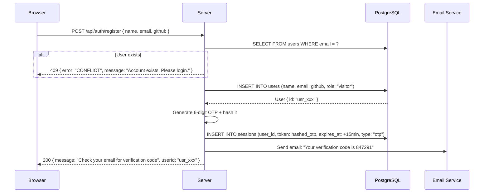
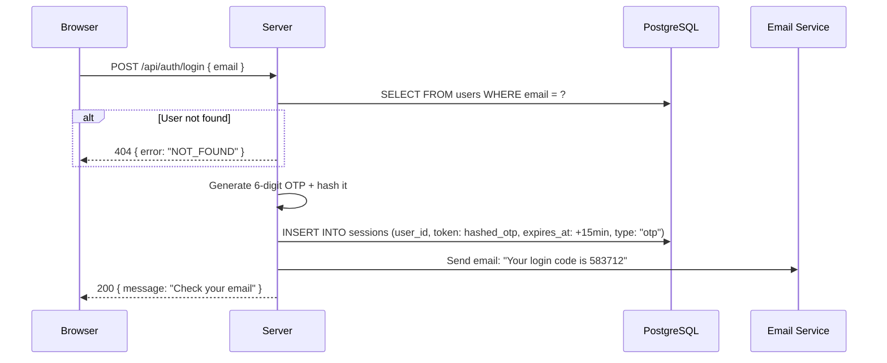
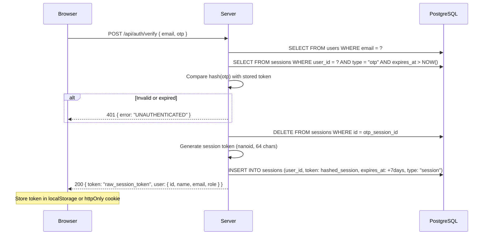
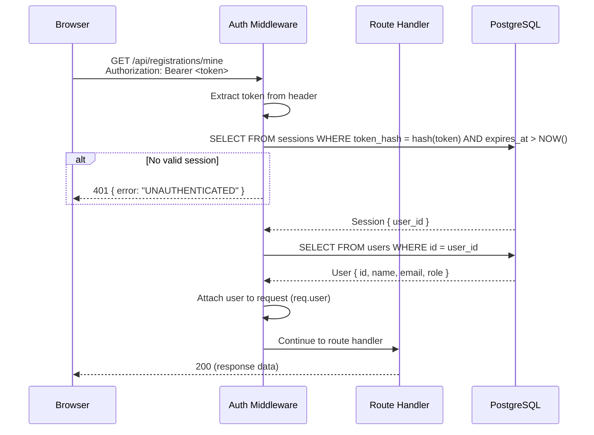
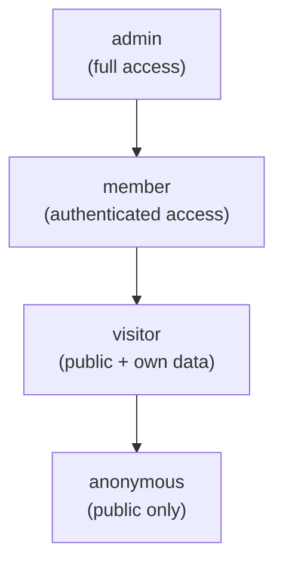

# 04 — AUTH SYSTEM

> **Tech Yuva Engineering Bible** — Document 5 of 13  
> **Status:** Draft v1.0  
> **Last Updated:** 2026-07-12  
> **Owner:** Engineering  
> **Classification:** Internal — Engineering  
> **Prerequisites:** [00_PROJECT_CONTEXT.md](./00_PROJECT_CONTEXT.md), [03_DATABASE.md](./03_DATABASE.md)

---

## 1. Current State (Broken)

| Problem | Impact | Severity |
|---------|--------|----------|
| Admin identified by hardcoded email in client source | Anyone can impersonate admin | P0 |
| Auth via `x-user-email` header (trivially spoofable) | No actual authentication | P0 |
| IdentitySwitcher allows role simulation in production | Complete RBAC bypass | P0 |
| Firebase Admin SDK initialized but not used for auth | Dead dependency, confusion | P1 |
| No session management | Every request requires re-identification | P1 |
| `/api/users` endpoint exposes all user data without auth | Data leak | P1 |
| Role assigned by email substring matching (`admin` in email → admin role) | Privilege escalation | P0 |

**Bottom line:** The current "auth" system provides zero security. It is a simulation suitable for demos only.

---

## 2. Auth Strategy Selection

### Options Evaluated

| Option | Pros | Cons | Verdict |
|--------|------|------|---------|
| **Magic Link (email OTP)** | No passwords. Simple UX. Low friction. | Requires SMTP. 30-60s delay for email delivery. | ✅ **Selected for V1** |
| **Firebase Auth** | Google/GitHub SSO. | Adds client-side SDK dependency. Auth state split between Firebase and server. Over-engineered for current needs. | Rejected |
| **Password-based** | Standard. No external dependency. | Password storage liability. Users forget passwords. Reset flow needed. | Rejected |
| **Passkeys/WebAuthn** | Most secure. Great UX once set up. | Limited browser support on older devices. Complex server implementation. | Deferred to V3 |
| **OAuth only (Google/GitHub)** | Fast. No passwords. | Requires OAuth provider setup. Students may not have GitHub. | Deferred to V2 (as optional) |

### Why Magic Link

1. **Zero password liability** — No bcrypt, no salt, no password reset flow, no breach risk.
2. **Natural email verification** — If you can click the link, you own the email. No separate verification step.
3. **Low friction** — Students already expect "sign in with email" from Notion, Linear, and Vercel.
4. **Simple implementation** — Generate token, send email, verify token. Three operations.
5. **SMTP is the only dependency** — And we need SMTP anyway for registration confirmations.

### Permanent Decision: Reject Firebase Auth

Firebase Auth (along with the `firebase` and `firebase-admin` dependencies) has been permanently removed from the project.
The rationale is to maintain a unified PostgreSQL-based session architecture, avoiding split state between a third-party client SDK and our backend, and minimizing frontend bundle size.
If OAuth (Google/GitHub) is needed in the future, it will be implemented via server-side OAuth flows using Passport.js or native OAuth integrations that issue standard PostgreSQL sessions, NOT Firebase.

---

## 3. Auth Flow: Magic Link

### Registration



### Login



### Verify OTP



### Authenticated Request



---

## 4. Role-Based Access Control (RBAC)

### Role Hierarchy



### Role Definitions

| Role | Description | How Assigned |
|------|-------------|-------------|
| `anonymous` | No account. Not in database. | Default state |
| `visitor` | Has an account (email verified). Default role on registration. | Auto on registration/OTP verify |
| `member` | Active community participant. Can access member dashboard. | Admin promotes via CMS |
| `admin` | Full platform control. CMS, events, analytics, user management. | `ADMIN_EMAILS` env var on first login, or existing admin promotes |

### Permission Matrix

| Resource | Anonymous | Visitor | Member | Admin |
|----------|-----------|---------|--------|-------|
| **View events** | ✅ | ✅ | ✅ | ✅ |
| **Register for event** | ✅ (creates visitor account) | ✅ | ✅ | ✅ |
| **View own registrations** | ❌ | ✅ | ✅ | ✅ |
| **View own certificates** | ❌ | ✅ | ✅ | ✅ |
| **View member dashboard** | ❌ | ❌ | ✅ | ✅ |
| **View public CMS content** | ✅ | ✅ | ✅ | ✅ |
| **Verify certificate (public)** | ✅ | ✅ | ✅ | ✅ |
| **Use AI chat** | ✅ | ✅ | ✅ | ✅ |
| **Create/edit events** | ❌ | ❌ | ❌ | ✅ |
| **Manage registrations** | ❌ | ❌ | ❌ | ✅ |
| **Mark attendance** | ❌ | ❌ | ❌ | ✅ |
| **Edit CMS content** | ❌ | ❌ | ❌ | ✅ |
| **View analytics** | ❌ | ❌ | ❌ | ✅ |
| **Manage users** | ❌ | ❌ | ❌ | ✅ |
| **View all user data** | ❌ | ❌ | ❌ | ✅ |
| **Delete events/users** | ❌ | ❌ | ❌ | ✅ |

### Middleware Implementation

Three middleware functions, each building on the previous:

| Middleware | Checks | Used On |
|-----------|--------|---------|
| `requireAuth` | Valid session token exists. Attaches `req.user`. | `/api/registrations/mine`, `/api/certificates/mine`, `/api/auth/me` |
| `requireMember` | `requireAuth` + `req.user.role` is `member` or `admin` | `/api/member/*` (future) |
| `requireAdmin` | `requireAuth` + `req.user.role` is `admin` | All `/api/cms/*` mutations, `/api/events` POST/PATCH/DELETE, `/api/registrations/:id/attend` |

---

## 5. Session Management

### Session Token Specification

| Attribute | Value |
|-----------|-------|
| **Format** | 64-character nanoid (URL-safe alphabet) |
| **Storage (server)** | SHA-256 hash of token stored in `sessions.token` |
| **Storage (client)** | Raw token in `localStorage` (SPA) or `httpOnly` cookie |
| **Lifetime** | 7 days (configurable via `SESSION_TTL_DAYS` env var) |
| **Renewal** | No automatic renewal. User must re-login after expiry. |
| **Revocation** | DELETE from `sessions` table. Immediate effect. |

### Why hash the token server-side

If the database is compromised, the attacker gets hashed tokens — useless without the raw token. The raw token is only ever known to the user's browser and the server process (in memory, briefly).

### Session Cleanup

```sql
-- Run daily via cron or on-demand
DELETE FROM sessions WHERE expires_at < NOW();
```

On Cloud Run (no cron): run cleanup on every `POST /api/auth/verify` call. The cleanup query is cheap (uses `sess_expires_idx` index) and runs at most once per login.

### Client-Side Token Handling

| Approach | When to Use |
|----------|-------------|
| **`localStorage`** | Default for SPA. Simple. Survives page refresh. |
| **`httpOnly` cookie** | Better security (immune to XSS token theft). Requires `sameSite` and `secure` flags. Use when serving from a single domain. |

**Decision:** Use `localStorage` for V1. The trade-off (XSS can steal the token) is acceptable because:
1. The app has no user-generated HTML rendering (no `dangerouslySetInnerHTML`)
2. CSP headers will be enforced (09_SECURITY.md)
3. Migration to `httpOnly` cookies is straightforward in V2

---

## 6. Admin Bootstrapping

### Problem

How does the first admin get created? There's no admin to promote a user to admin.

### Solution: `ADMIN_EMAILS` Environment Variable

```
ADMIN_EMAILS=daksh@techyuva.org,lakshay@techyuva.org
```

On login, the server checks if the user's email is in `ADMIN_EMAILS`:

```
1. User logs in with email
2. Server checks: is email in ADMIN_EMAILS?
3. If yes AND user.role !== "admin":
   → UPDATE users SET role = "admin" WHERE id = user.id
4. User now has admin access
```

**Rules:**
- `ADMIN_EMAILS` is a server-side environment variable — never exposed to the client.
- It is a comma-separated list of email addresses.
- It only promotes users who already exist in the database (they must have registered or logged in first).
- Removing an email from `ADMIN_EMAILS` does NOT automatically demote the user. Demotion requires a manual database update or an admin action in the CMS.

### Admin Invite Flow (V2)

Once the first admin exists, they can invite additional admins through the CMS:

```
Admin A → POST /api/admin/invite { email, role: "admin" }
→ Server sends email: "You've been invited as an admin"
→ Invitee clicks link, logs in, gets promoted
```

---

## 7. Removing Current Auth Vulnerabilities

### Checklist

| # | Action | Details |
|---|--------|---------|
| 1 | **Remove hardcoded admin email from client** | Delete the `ADMIN_EMAIL` constant from `App.tsx:119`. Admin detection happens server-side via `ADMIN_EMAILS` env var. |
| 2 | **Remove IdentitySwitcher from production** | Gate with `if (import.meta.env.DEV)` or remove entirely. |
| 3 | **Remove email-substring role assignment** | Delete the logic in `server.ts:105-109` that assigns "admin" role if email contains "admin". |
| 4 | **Replace `x-user-email` header auth** | Replace with `Authorization: Bearer <token>` session-based auth. |
| 5 | **Add auth to `/api/users` endpoint** | Gate with `requireAdmin`. Or remove the endpoint entirely (it's only used by the admin panel). |
| 6 | **Add auth to `/api/registrations` (list all)** | Gate with `requireAdmin`. Add `/api/registrations/mine` for users. |
| 7 | **Remove Firebase Admin SDK** | Firebase Auth dependencies have been permanently uninstalled to reduce confusion and bundle size. |

---

## 8. Edge Cases

### Concurrent Login Attempts

**Scenario:** User requests a magic link, then requests another before the first expires.

**Handling:** Each OTP is independent. Multiple valid OTPs can exist simultaneously. Verifying any valid OTP creates a session. All remaining OTP sessions for that user are deleted on successful verification.

### Email Change

**Scenario:** User wants to change their email.

**Handling:** Not supported in V1. Email is the primary identifier. Supporting email change requires:
1. Verify new email (send OTP to new email)
2. Update `users.email`
3. Invalidate all existing sessions
4. Update all `registrations.email` (denormalized)

**Deferred to V2.**

### Account Deletion

**Scenario:** User requests account deletion (DPDP compliance).

**Handling:** See [03_DATABASE.md](./03_DATABASE.md) Section 11. Delete sessions → certificates → registrations → user.

### Brute Force OTP

**Scenario:** Attacker tries all 6-digit combinations (1,000,000 possibilities).

**Mitigations:**
1. OTP expires after 15 minutes
2. Rate limit `POST /api/auth/verify` to 5 attempts per email per 15 minutes
3. After 5 failed attempts, delete all OTP sessions for that email and require a new login request
4. 6-digit OTP with 15-minute window and 5 attempts = 0.0005% chance of brute force success

### Session Hijacking

**Scenario:** Attacker obtains a valid session token.

**Mitigations:**
1. Tokens are 64-character nanoid (2^384 entropy) — impossible to guess
2. HTTPS only — tokens cannot be intercepted in transit
3. Token stored as SHA-256 hash in DB — database breach doesn't yield usable tokens
4. Session expires in 7 days — limits exposure window
5. V2: Bind session to IP address (optional, may break for mobile users switching networks)

---

## 9. Accessibility Considerations

| Requirement | Implementation |
|-------------|---------------|
| Login form is keyboard-navigable | Standard `<form>` with `<input>` and `<button>`. Tab order is natural. |
| OTP input accepts paste | Single `<input type="text" inputMode="numeric">`, not 6 separate boxes. Users can paste from email. |
| Error messages announced to screen readers | Use `aria-live="polite"` region for error display. |
| Loading states communicated | "Sending verification code..." with `aria-busy="true"` on the form. |

---

## 10. Email Templates

### OTP Email

| Field | Value |
|-------|-------|
| **Subject** | Your Tech Yuva verification code |
| **From** | noreply@techyuva.org |
| **Body** | Plain text + minimal HTML |

```
Your verification code for Tech Yuva:

847291

This code expires in 15 minutes.
If you didn't request this, you can safely ignore this email.
```

### Registration Confirmation

| Field | Value |
|-------|-------|
| **Subject** | You're registered for [Event Name]! |
| **From** | events@techyuva.org |

```
Hey [Name],

You're registered for [Event Name]!

📅 Date: [Event Date]
📍 Venue: [Venue]
🎫 Ticket ID: [Registration ID]

See you there!
— Tech Yuva
```

---

## Current Status

| Attribute | Value |
|-----------|-------|
| **Document Status** | Complete — Draft v1.0 |
| **Auth Implementation** | Non-functional. Header-based, no sessions, hardcoded admin. |
| **RBAC** | Defined in DB schema (3 roles) but not enforced. |
| **Sessions** | No session table or token management. |
| **Email** | No SMTP configured. |

## Dependencies

| Dependency | Status | Blocking |
|------------|--------|----------|
| SMTP provider (Resend / Postmark) | Not configured | Yes — magic link flow |
| `nanoid` | Not installed | Yes — session token generation |
| `SESSION_SECRET` env var | Not set | Yes — token hashing |
| `ADMIN_EMAILS` env var | Not set | Yes — admin bootstrapping |
| `sessions` table | Not created | Yes — session storage |

## Implementation Priority

| Task | Priority | Effort | Depends On |
|------|----------|--------|------------|
| Create `sessions` table migration | P0 | 0.5 days | 03_DATABASE.md migration setup |
| Implement magic link flow (register/login/verify) | P0 | 2 days | SMTP provider, sessions table |
| Implement auth middleware (requireAuth/requireAdmin) | P0 | 0.5 days | Session flow |
| Apply middleware to all protected routes | P0 | 0.5 days | Middleware |
| Remove IdentitySwitcher from production | P0 | 0.25 days | None |
| Remove hardcoded admin email | P0 | 0.25 days | ADMIN_EMAILS env var |
| Remove email-substring role assignment | P0 | 0.25 days | None |
| Client-side auth state management (useAuth hook) | P1 | 1 day | Server-side auth |

## Future Improvements

1. **OAuth providers** — Google and GitHub SSO via native server-side OAuth flows (No Firebase).
2. **Multi-factor authentication** — For admin accounts (V3).
3. **API keys** — For public API consumers (V3).
4. **Token refresh** — Sliding window session extension (V2).
5. **Audit log** — Track all auth events (login, logout, role changes) for compliance.
6. **Device management** — Allow users to view and revoke active sessions.

## Related Documents

- `03_DATABASE.md` — Sessions table schema and data deletion procedures
- `02_ARCHITECTURE.md` — Auth middleware in server decomposition
- `05_CMS.md` — Admin-gated CMS operations
- `07_ADMIN.md` — Admin bootstrapping and user management
- `09_SECURITY.md` — Brute force prevention, rate limiting, token security
