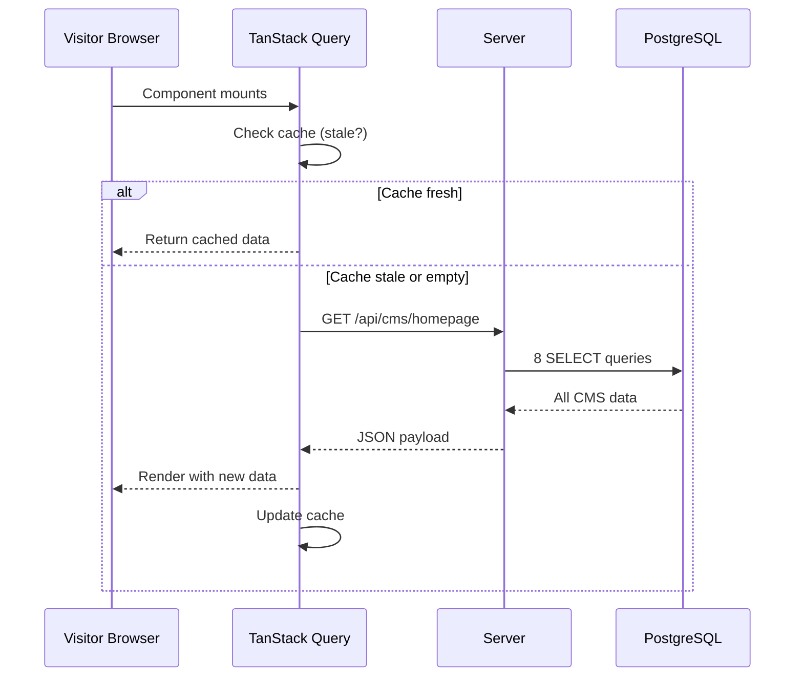

# 05 — CMS

> **Tech Yuva Engineering Bible** — Document 6 of 13  
> **Status:** Draft v1.0  
> **Last Updated:** 2026-07-12  
> **Owner:** Engineering  
> **Classification:** Internal — Engineering  
> **Prerequisites:** [02_ARCHITECTURE.md](./02_ARCHITECTURE.md), [03_DATABASE.md](./03_DATABASE.md), [04_AUTH_SYSTEM.md](./04_AUTH_SYSTEM.md)

---

## 1. CMS Scope

The CMS manages all **editable content sections** of the public-facing homepage. It is NOT a general-purpose CMS (not WordPress, not Strapi). It is a **purpose-built admin interface** for Tech Yuva's specific content blocks.

### What the CMS Controls

| Section | DB Table(s) | Admin Can Edit |
|---------|-------------|---------------|
| **Hero** | `hero_content` | Badge text, title, subtitle, description, CTA buttons, stats, announcement banner, terminal code |
| **Founder Vision** | `founder_content` | Name, role, photo URL, video URL, quote, biography |
| **About Cards** | `about_cards` | Heading, description, icon, display order, image |
| **Offerings** | `offerings` | Title, description, icon, display order, status |
| **Gallery** | `gallery` | Title, media URL, type, category, stats, highlight text, featured flag |
| **Sponsors** | `sponsors` | Name, logo, website, tier, display order, contribution, featured flag |
| **Testimonials** | `testimonials` | Name, role, org, rating, quote, avatar, approved flag |
| **Announcements** | `announcements` | Title, message, type, enabled, scheduled start/end |
| **Site Settings** | `site_settings` | Community name, logo, theme colors, contact info, social links, footer, toggles |
| **SEO** | `seo_settings` | Meta title, description, OG image, keywords, canonical URL, JSON-LD |

### What the CMS Does NOT Control

| Item | Why Not |
|------|---------|
| Events | Managed separately via Events API (see [06_EVENTS.md](./06_EVENTS.md)) |
| Users | Managed via Auth and Admin (see [04_AUTH_SYSTEM.md](./04_AUTH_SYSTEM.md), [07_ADMIN.md](./07_ADMIN.md)) |
| AI Knowledge Base | Managed via seed scripts and admin knowledge editor (see [08_AI_ASSISTANT.md](./08_AI_ASSISTANT.md)) |
| Code/Layout | CMS edits content, not structure. Page layout is defined in code. |

---

## 2. CMS Architecture

### Data Flow

```mermaid
graph LR
    subgraph Admin["Admin Browser"]
        Panel["Admin CMS Panel<br/>(React Component)"]
    end

    subgraph API["Express Server"]
        Pub["GET /api/cms/homepage<br/>(public, no auth)"]
        Mut["PATCH/POST/DELETE /api/cms/*<br/>(requireAdmin)"]
    end

    subgraph DB["PostgreSQL"]
        Tables["10 CMS tables"]
    end

    subgraph Visitor["Visitor Browser"]
        Home["Homepage Sections<br/>(TanStack Query cache)"]
    end

    Panel -->|Mutations| Mut
    Mut -->|Drizzle ORM| Tables
    Mut -->|200 OK| Panel
    Panel -->|invalidateQueries('cmsData')| Panel

    Home -->|GET /api/cms/homepage| Pub
    Pub -->|8 SELECT queries| Tables
    Tables -->|JSON| Pub
    Pub -->|Combined payload| Home
```

### Single Payload Pattern

The public endpoint `GET /api/cms/homepage` returns ALL CMS content in one response:

```json
{
  "siteSettings": { ... },
  "seoSettings": { ... },
  "heroContent": { ... },
  "founderContent": { ... },
  "aboutCards": [ ... ],
  "offerings": [ ... ],
  "gallery": [ ... ],
  "sponsors": [ ... ],
  "testimonials": [ ... ],
  "announcements": [ ... ]
}
```

**Why one endpoint, not ten:**
1. Homepage needs all this data on initial render — 1 HTTP round trip vs. 10
2. TanStack Query caches the single key `["cmsData"]` — simple invalidation
3. Total payload: ~15-30KB — well within single request budget
4. No waterfall: all data arrives simultaneously

**Cache configuration:**
```
staleTime: 60 seconds
refetchInterval: 120 seconds
cacheTime: 10 minutes
```

---

## 3. CMS API Specification

### Public Endpoint

| Method | Path | Auth | Response |
|--------|------|------|----------|
| `GET` | `/api/cms/homepage` | None | Full CMS payload (all 10 sections) |

### Singleton Sections (PATCH only — upsert pattern)

These sections have exactly one record each (id = "global"):

| Method | Path | Auth | Description |
|--------|------|------|-------------|
| `PATCH` | `/api/cms/hero` | Admin | Update hero section |
| `PATCH` | `/api/cms/founder` | Admin | Update founder section |
| `PATCH` | `/api/cms/seo` | Admin | Update SEO metadata |
| `PATCH` | `/api/cms/site` | Admin | Update site-wide settings |

**Upsert behavior:** All PATCH endpoints use `INSERT ... ON CONFLICT DO UPDATE`. If the "global" row doesn't exist, it's created. If it exists, it's updated. This eliminates the need for a separate POST endpoint.

**Partial update:** Only fields present in the request body are updated. Missing fields retain their current values. The server merges the request body with the existing record.

### Collection Sections (Full CRUD)

| Section | POST | PATCH | DELETE |
|---------|------|-------|--------|
| About Cards | `POST /api/cms/about` | `PATCH /api/cms/about/:id` | `DELETE /api/cms/about/:id` |
| Offerings | `POST /api/cms/offerings` | `PATCH /api/cms/offerings/:id` | `DELETE /api/cms/offerings/:id` |
| Gallery | `POST /api/cms/gallery` | `PATCH /api/cms/gallery/:id` | `DELETE /api/cms/gallery/:id` |
| Sponsors | `POST /api/cms/sponsors` | `PATCH /api/cms/sponsors/:id` | `DELETE /api/cms/sponsors/:id` |
| Testimonials | `POST /api/cms/testimonials` | `PATCH /api/cms/testimonials/:id` | `DELETE /api/cms/testimonials/:id` |
| Announcements | `POST /api/cms/announcements` | `PATCH /api/cms/announcements/:id` | `DELETE /api/cms/announcements/:id` |

All collection mutations require `requireAdmin` middleware.

### Media Library

| Method | Path | Auth | Description |
|--------|------|------|-------------|
| `GET` | `/api/cms/media` | Admin | List all uploaded media |
| `POST` | `/api/cms/media` | Admin | Create media reference |
| `DELETE` | `/api/cms/media/:id` | Admin | Delete media reference |

> [!IMPORTANT]
> The current media library stores URL references only — no actual file upload. Files are assumed to be hosted externally (Unsplash, Cloud Storage, etc.). Actual file upload capability is a V2 feature requiring Cloud Storage integration.

---

## 4. Request/Response Schemas

### Hero Content — PATCH /api/cms/hero

**Request body (all fields optional — partial update):**

| Field | Type | Constraints | Description |
|-------|------|-------------|-------------|
| `badge` | string | max 100 chars | Top badge text (e.g., "Next: YuvaHack 2026") |
| `title` | string | max 200 chars | Main hero heading |
| `subtitle` | string | max 300 chars | Subheading |
| `description` | string | max 1000 chars | Paragraph text |
| `ctaButton1Text` | string | max 50 chars | Primary CTA label |
| `ctaButton1Link` | string | valid URL or anchor | Primary CTA target |
| `ctaButton2Text` | string | max 50 chars | Secondary CTA label |
| `ctaButton2Link` | string | valid URL or anchor | Secondary CTA target |
| `announcementBanner` | string \| null | max 200 chars | Alert banner text (null = hidden) |
| `stats` | object[] | max 6 items | `[{ label: string, value: string }]` |
| `mediaUrl` | string \| null | valid URL | Hero media (image/video) |
| `terminalCode` | string | max 2000 chars | Code block for terminal display |

**Response:**
```json
{
  "success": true,
  "heroContent": { /* full hero_content row */ }
}
```

### Sponsor — POST /api/cms/sponsors

**Request body:**

| Field | Type | Required | Constraints | Description |
|-------|------|----------|-------------|-------------|
| `name` | string | Yes | max 100 chars | Company name |
| `logo` | string | Yes | valid URL | Logo image URL |
| `website` | string | Yes | valid URL | Company website |
| `tier` | string | No | `platinum` \| `gold` \| `silver` \| `partner` | Default: `partner` |
| `displayOrder` | number | No | >= 0 | Sort position. Default: 0 |
| `featured` | boolean | No | — | Homepage spotlight. Default: false |
| `statusText` | string | No | max 100 chars | Display badge (e.g., "Cloud Partner") |
| `contribution` | string | No | max 500 chars | What they provide |
| `domain` | string | No | max 100 chars | Industry domain |

### Announcement — POST /api/cms/announcements

| Field | Type | Required | Constraints | Description |
|-------|------|----------|-------------|-------------|
| `title` | string | Yes | max 200 chars | Headline |
| `message` | string | Yes | max 2000 chars | Body text |
| `enabled` | boolean | No | — | Active/inactive. Default: true |
| `type` | string | No | `info` \| `success` \| `warning` \| `urgent` | Visual style. Default: `info` |
| `scheduledStart` | ISO 8601 | No | valid date | Show after this time |
| `scheduledEnd` | ISO 8601 | No | valid date | Hide after this time |

---

## 5. Validation Rules

All CMS mutations must validate input using Zod schemas before database operations.

### General Rules

| Rule | Application |
|------|------------|
| **No empty strings** | All required text fields must have `.min(1)` |
| **URL validation** | All URL fields must match `z.string().url()` |
| **Max lengths** | Prevent database abuse. See per-field constraints above. |
| **Sanitize HTML** | Strip all HTML tags from text fields. CMS content is plain text + markdown only. |
| **Icon validation** | `icon` fields must be valid Lucide icon names (validate against a whitelist or accept any string and handle missing icons gracefully in the frontend) |
| **Display order** | Must be non-negative integer. Default: 0. |
| **Rating** | 1-5 integer (testimonials). Enforced at DB level with CHECK constraint. |

### Announcement Scheduling

| Validation | Rule |
|-----------|------|
| `scheduledEnd` > `scheduledStart` | If both are set, end must be after start |
| Past `scheduledEnd` | Announcement auto-hidden (filter in query) |
| No `scheduledStart` | Immediately visible (if `enabled: true`) |

---

## 6. Admin CMS UI Requirements

### Current Problem

`AdminCMS.tsx` is 109KB — the largest file in the codebase. It contains all CMS editing forms in a single component.

### Target: Section-Based Tabs

```
Admin CMS Dashboard
├── [Tab] Hero Editor         → Edit hero content (title, CTAs, stats)
├── [Tab] Founder Editor      → Edit founder bio (name, quote, photo)
├── [Tab] About Cards         → CRUD list with drag-to-reorder
├── [Tab] Offerings           → CRUD list with active/inactive toggle
├── [Tab] Gallery             → Grid view with upload + edit + delete
├── [Tab] Sponsors            → Tiered list (platinum → partner)
├── [Tab] Testimonials        → CRUD list with approved/unapproved filter
├── [Tab] Announcements       → CRUD list with scheduling UI
├── [Tab] Site Settings       → Form (name, logo, contact, social links)
├── [Tab] SEO                 → Form (meta tags, OG image, JSON-LD)
├── [Tab] Media Library       → Grid view of uploaded media
```

### UI Principles for Admin Panel

| Principle | Rationale |
|-----------|-----------|
| **No animations** | Admin needs speed, not vibes. Every ms of animation is wasted admin time. |
| **Instant save** | PATCH on change, not "save button" → loading → confirmation. Use optimistic updates. |
| **Inline editing** | Click a field to edit in place. No "edit modal" unless the form is complex. |
| **Reorder by drag** | `displayOrder` fields should be editable via drag-and-drop, not number input. |
| **Confirmation on delete** | Always confirm destructive actions. Show what's being deleted. |
| **Optimistic updates** | Update UI immediately, revert on API failure. TanStack Query `optimisticUpdate` pattern. |

---

## 7. Content Rendering

### How CMS Data Reaches the User



### Fallback Data

If the CMS query fails or returns `null` for any section, the frontend falls back to static data from `data.ts`. This ensures the homepage always renders, even if the database is down.

| Section | Fallback Source | Behavior |
|---------|----------------|----------|
| Hero | `data.ts` hero defaults | Title, subtitle, CTAs from static data |
| Events | `data.ts` events array | Static event list (no registration) |
| Sponsors | `data.ts` sponsors array | Static sponsor display |
| Testimonials | `data.ts` testimonials array | Static testimonial cards |
| Everything else | Hardcoded in component | Reasonable defaults |

> [!WARNING]
> The current fallback data contains fabricated sponsors and testimonials. The fallback content must be cleaned to show only verifiable information, or show a "content loading" placeholder instead.

---

## 8. Content Versioning (V2)

Not implemented in V1. Design for V2:

| Feature | Description |
|---------|-------------|
| **Version history** | Every PATCH creates a version record (previous state + timestamp + author) |
| **Rollback** | Admin can revert to any previous version |
| **Preview** | Admin can preview changes before publishing (draft → published states) |
| **Diff view** | Show what changed between versions |

**Schema addition (V2):**

```
cms_versions
├── id (PK)
├── table_name (text)        # "hero_content", "about_cards", etc.
├── record_id (text)         # ID of the edited record
├── previous_data (jsonb)    # Snapshot of the record before change
├── changed_by (text → users.id)
├── changed_at (timestamp)
```

---

## 9. Performance Considerations

| Concern | Mitigation |
|---------|-----------|
| **8 queries per homepage load** | At current data volume (< 50 rows per table), this is < 30ms total. Add server-side cache (60s TTL) if it exceeds 100ms. |
| **AdminCMS.tsx is 109KB** | Lazy-load the admin panel. It should not be in the initial bundle for visitors. Use `React.lazy()` + `Suspense`. |
| **Image URLs in CMS** | CMS stores URL references. Images should be served from a CDN or Cloud Storage, not from the Express server. |
| **Large text fields** | `description` and `biography` are unbounded `text` columns. Add max-length validation (2000 chars for descriptions, 5000 for biographies) to prevent abuse. |

---

## 10. Security Considerations

| Concern | Control |
|---------|---------|
| **All mutations require admin** | `requireAdmin` middleware on every CMS write endpoint |
| **Input sanitization** | Strip HTML tags from all text inputs. No raw HTML rendering. |
| **URL validation** | All URL fields validated with `z.string().url()` to prevent javascript: protocol attacks |
| **File upload (V2)** | When implemented: validate MIME type, enforce max file size (5MB), scan for malware, store in Cloud Storage (not local filesystem) |
| **Rate limiting** | CMS mutations: 30 req/min per admin. Prevents accidental rapid-fire saves. |

---

## Current Status

| Attribute | Value |
|-----------|-------|
| **Document Status** | Complete — Draft v1.0 |
| **CMS API** | Functional. 10 sections with full CRUD. All endpoints work. |
| **Auth on CMS** | Partially implemented via `requireAdmin` middleware using `x-user-email` header (spoofable). Must migrate to session-based auth. |
| **Validation** | Minimal. Only "required field" checks. No Zod schemas. |
| **Admin UI** | Single 109KB component. Functional but monolithic. |
| **Content Versioning** | Not implemented. |
| **Media Upload** | URL references only. No file upload capability. |

## Dependencies

| Dependency | Status | Blocking |
|------------|--------|----------|
| Auth system overhaul (04_AUTH_SYSTEM.md) | Not started | Yes — CMS mutations must use real auth |
| `zod` | Not installed | Yes — input validation |
| Cloud Storage bucket | Not provisioned | Yes — media upload (V2) |

## Implementation Priority

| Task | Priority | Effort |
|------|----------|--------|
| Add Zod validation to all CMS endpoints | P1 | 1 day |
| Migrate `requireAdmin` to session-based auth | P0 | Depends on auth overhaul |
| Lazy-load AdminCMS component | P1 | 0.25 days |
| Split AdminCMS into tab-based sub-components | P2 | 2 days |
| Clean fabricated fallback data | P0 | 0.5 days |
| Add max-length constraints to text fields | P1 | 0.5 days |

## Future Improvements

1. **Content versioning** — Draft/published states, rollback, diff view (V2).
2. **File upload** — Direct upload to Cloud Storage with signed URLs (V2).
3. **Rich text editor** — Markdown editor for description fields (V2).
4. **Content scheduling** — Set publish date for any CMS section (V2).
5. **Multi-language support** — i18n for CMS content (V3).
6. **Audit trail** — Log every CMS change with timestamp and author (V2).

## Related Documents

- `02_ARCHITECTURE.md` — API specification and server decomposition
- `03_DATABASE.md` — CMS table schemas and indexing
- `04_AUTH_SYSTEM.md` — Admin authentication and middleware
- `07_ADMIN.md` — Admin dashboard (CMS is one tab of the admin panel)
- `09_SECURITY.md` — Input sanitization and rate limiting
