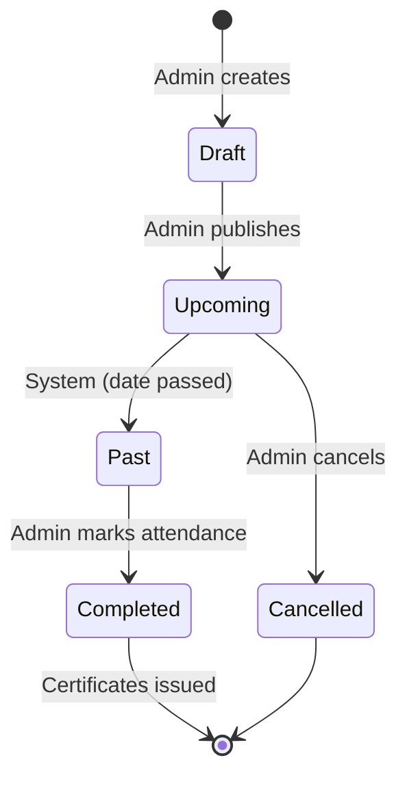
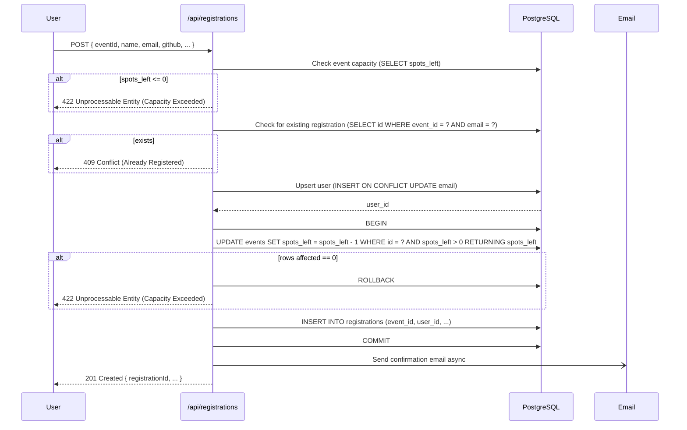
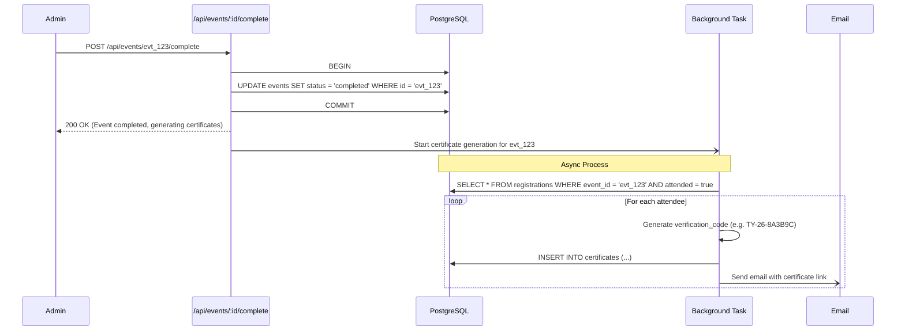

# 06 — EVENTS

> **Tech Yuva Engineering Bible** — Document 7 of 13  
> **Status:** Draft v1.0  
> **Last Updated:** 2026-07-12  
> **Owner:** Engineering  
> **Classification:** Internal — Engineering  
> **Prerequisites:** [03_DATABASE.md](./03_DATABASE.md), [04_AUTH_SYSTEM.md](./04_AUTH_SYSTEM.md)

---

## 1. Event Lifecycle

An event in Tech Yuva moves through five strict states.



| State | Visibility | Registration | Actions Available |
|-------|------------|--------------|-------------------|
| `draft` | Admin only | Closed | Edit details, Publish, Delete |
| `upcoming` | Public | Open (if spots > 0) | Edit details, Cancel, View registrations |
| `past` | Public | Closed | Mark attendance, Complete |
| `completed`| Public | Closed | View certificates, View analytics |
| `cancelled`| Public (marked) | Closed | None (terminal state) |

### State Transitions

- **Upcoming → Past:** Auto-transition when `event_date < CURRENT_DATE`. Handled by a daily cron or lazily checked on `GET /api/events`.
- **Past → Completed:** Manual admin action. Triggers certificate generation for all attended users. This is a one-way operation.

---

## 2. Event Registration Flow

The registration flow is the core conversion funnel of the platform.

### Requirements

1. **Frictionless:** Users should not need to "create an account" first. Registration *is* the account creation.
2. **Duplicate Prevention:** A user cannot register twice for the same event.
3. **Capacity Enforcement:** Registration must fail if `spots_left == 0`.
4. **Race Condition Safety:** Concurrent registrations must not overallocate spots.

### Technical Implementation



### Critical Concurrency Fix

Currently, `spotsLeft` is checked in memory and updated non-atomically. The SQL transaction above (specifically the `UPDATE ... WHERE spots_left > 0 RETURNING`) is mandatory to prevent negative capacity under load.

---

## 3. Attendance & Certificates

Tech Yuva automates credential issuance. When an admin verifies attendance, the system issues verifiable certificates.

### Attendance Flow

1. Admin opens the event dashboard (must be in `past` state).
2. Admin sees the list of registered users.
3. Admin toggles attendance (true/false) for each user.
   - API: `PATCH /api/registrations/:id/attend { attended: true }`
4. When finished, Admin clicks "Complete Event".
   - API: `POST /api/events/:id/complete`

### Certificate Generation Flow

The `Complete Event` action triggers the generation.



### Certificate Verification

Certificates must be publicly verifiable by anyone (e.g., a recruiter clicking a link on a student's LinkedIn profile).

- **URL:** `https://techyuva.org/verify/:code`
- **API:** `GET /api/certificates/verify/:code`
- **Response:**
  ```json
  {
    "valid": true,
    "certificate": {
      "recipientName": "Daksh Chaudhary",
      "eventTitle": "YuvaHack 2026",
      "issueDate": "2026-07-15T12:00:00Z",
      "verificationCode": "TY-26-8A3B9C"
    }
  }
  ```

---

## 4. API Endpoints (Events Domain)

| Method | Endpoint | Auth | Purpose |
|--------|----------|------|---------|
| `GET` | `/api/events` | None | List upcoming/past events (paginated) |
| `GET` | `/api/events/:id` | None | Get specific event details |
| `POST` | `/api/events` | Admin | Create a new event |
| `PATCH`| `/api/events/:id` | Admin | Update event details |
| `DELETE`| `/api/events/:id`| Admin | Delete event (cascades) |
| `GET` | `/api/events/:id/registrations` | Admin | List attendees for an event |
| `POST` | `/api/events/:id/complete` | Admin | Lock event, issue certs |
| `POST` | `/api/registrations` | None | Register for an event |
| `PATCH`| `/api/registrations/:id/attend` | Admin | Mark user as attended |
| `GET` | `/api/registrations/mine` | Auth | Get current user's registrations |
| `GET` | `/api/certificates/mine` | Auth | Get current user's certificates |
| `GET` | `/api/certificates/verify/:code` | None | Verify a certificate |

---

## 5. Waitlist Strategy (V2)

Currently, when `spots_left == 0`, registration fails. In V2, we implement a waitlist.

1. When `spots_left == 0`, users can still register, but `status` is set to `waitlisted`.
2. If an existing attendee cancels (`DELETE /api/registrations/:id`), a trigger or application logic checks the waitlist.
3. The first waitlisted user is promoted to `confirmed`, and an email is sent.

**Database changes needed (V2):**
- Add `status` enum to `registrations` (`confirmed`, `waitlisted`, `cancelled`).

---

## 6. Implementation Priorities

1. **Fix atomic spot decrement (P0):** Implement the SQL-level check to prevent negative capacity.
2. **User upsert on registration (P0):** Ensure registration creates a proper user account linked to auth.
3. **Event Date type fix (P1):** Migrate text dates to actual `date` types for sorting and auto-archival.
4. **Attendance UI (P1):** Build the admin view to toggle attendance efficiently.
5. **Auto-archival (P2):** Implement the logic to move past events out of the "upcoming" view automatically.

## Related Documents
- [03_DATABASE.md](./03_DATABASE.md) (ERD and indexing for events)
- [04_AUTH_SYSTEM.md](./04_AUTH_SYSTEM.md) (Auth required for event management)
- [07_ADMIN.md](./07_ADMIN.md) (Admin UI for managing the event lifecycle)
